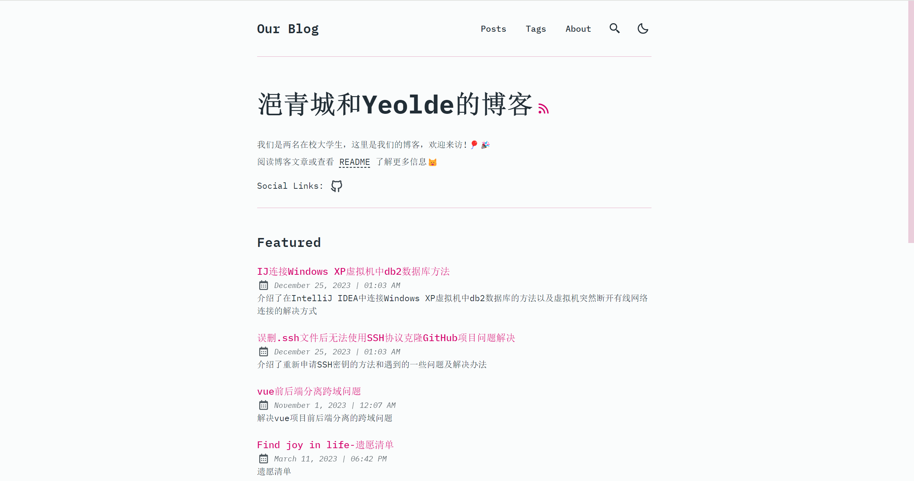

# 浥青城和Yeolde的博客 📄



[](https://conventionalcommits.org)
[](http://commitizen.github.io/cz-cli/)

**其他语言版本: [English](README.md), [中文](README_zh.md).**

请看实践：[ourBlog](https://zhujiashun.cn)

AstroPaper是一个最小、响应迅速、可访问和SEO友好的Astro博客主题。我们的博客是基于他的模板进行改进的一个个性化更强的模板。我们加入了一些大学生可能更加喜欢的元素，并在我们的博客上应用一些有趣的前端实践，我们都是软件工程专业的学生，我们日常的学习历程和踩坑分享也会在这里发布。

## 🔥 特征

- [x] 类型安全的 Markdown
- [x] 超快性能
- [x] 响应式布局
- [x] SEO友好
- [x] 明暗模式
- [x] 模糊搜索
- [x] 草稿帖子和分页
- [x] 网站地图和RSS订阅
- [x] 博客文章的动态 OG 图像生成 [#15](https://github.com/satnaing/astro-paper/pull/15) ([Blog Post](https://astro-paper.pages.dev/posts/dynamic-og-image-generation-in-astropaper-blog-posts/))

_Note: 我们的模板添加了很多个性化的元素和组件，如果想要遵循最佳实践原则和最大程度的可定制化，请参考原模板：([satnaing.dev](https://github.com/satnaing/satnaing.dev/tree/deployment))_

## ✅ Lighthouse 得分

<p align="center">
  <a href="https://pagespeed.web.dev/report?url=https%3A%2F%2Fastro-paper.pages.dev%2F&form_factor=desktop">
    
  <a>
</p>


## 🚀 项目结构

在AstroPaper内部，您将看到以下文件夹和文件:

```bash
/
├── public/
│   ├── assets/
│   │   └── logo.svg
│   │   └── logo.png
│   └── favicon.svg
│   └── astropaper-og.jpg
│   └── robots.txt
│   └── toggle-theme.js
├── src/
│   ├── assets/
│   │   └── socialIcons.ts
│   ├── components/
│   ├── content/
│   │   |  blog/
│   │   |    └── some-blog-posts.md
│   │   └── config.ts
│   ├── layouts/
│   └── pages/
│   └── styles/
│   └── utils/
│   └── config.ts
│   └── types.ts
└── package.json
```

Astro在`src/pages/`目录中查找 `.astro` 或者 `.md`文件。每个页面都根据其文件名显示为一个路由。

任何静态资产，如图像，都可以放在`public/`目录中。

所有博客文章都存储在`src/content/blog`目录中。

## 📖 文档

文档有两种方式可供阅读\_ _markdown_ & _blog post_.

- 配置主题－[markdown](src/content/blog/astropaper配置主题.md) | [blog post](https://yeolde.fun/posts/astropaper配置主题/)
- 创建新文章 - [markdown](src/content/blog/astropaper创建新文章.md) | [blog post](https://yeolde.cn/posts/astropaper创建新文章/)

## 💻 技术栈

**主要框架** - [Astro](https://astro.build/)  
**类型检查** - [TypeScript](https://www.typescriptlang.org/)  
**组件框架** - [ReactJS](https://reactjs.org/)  
**样式** - [TailwindCSS](https://tailwindcss.com/)  
**UI/UX** - [Figma](https://figma.com)  
**模糊搜索** - [FuseJS](https://fusejs.io/)  
**图标** - [Boxicons](https://boxicons.com/) | [Tablers](https://tabler-icons.io/)  
**代码格式化** - [Prettier](https://prettier.io/)  
**部署** - [Cloudflare Pages](https://pages.cloudflare.com/)  
**代码检查** - [ESLint](https://eslint.org)

## 👨🏻‍💻 本地运行

在本地运行此项目的最简单方法是在所需目录中运行以下命令。

```bash
# npm 6.x
npm create astro@latest --template satnaing/astro-paper

# npm 7+, extra double-dash is needed:
npm create astro@latest -- --template satnaing/astro-paper

# yarn
yarn create astro --template satnaing/astro-paper
```

## 谷歌网站验证 (可选)

您可以使用环境变量轻松地在 AstroPaper 中添加 [Google Site Verification HTML 标签](https://support.google.com/webmasters/answer/9008080#meta_tag_verification&zippy=%2Chtml-tag)。此步骤是可选的。如果您不添加以下 env 变量，则 google-site-verification 代码不会显示在 html `<head>`部分中。

```bash
# in your environment variable file (.env)
PUBLIC_GOOGLE_SITE_VERIFICATION=your-google-site-verification-value
```

## 🧞 命令

所有命令都是从项目的根目录、终端运行的：

> **_注意!_** 对于 `Docker` 命令，我们必须将其[安装](https://docs.docker.com/engine/install/)在您的计算机中。

| Command                              | Action                                                       |
| :----------------------------------- | :----------------------------------------------------------- |
| `npm install`                        | 安装依赖项                                                   |
| `npm run dev`                        | 启动本地开发服务器 `localhost:4321`                          |
| `npm run build`                      | 建立您的生产站点到目录 `./dist/`                             |
| `npm run preview`                    | 在部署之前在本地预览生成                                     |
| `npm run format:check`               | 使用 Prettier 检查代码格式                                   |
| `npm run format`                     | 使用 Prettier 格式化代码                                     |
| `npm run sync`                       | 为所有 Astro 模块生成 TypeScript 类型。 [Learn more](https://docs.astro.build/en/reference/cli-reference/#astro-sync). |
| `npm run cz`                         | 使用 commitizen 提交代码更改                                 |
| `npm run lint`                       | 使用 ESLint 的 Lint                                          |
| `docker compose up -d`               | 在 docker 上运行 AstroPaper，您可以使用 `dev` 命令通知的相同主机名和端口进行访问。 |
| `docker compose run app npm install` | 您可以在 docker 容器中运行上述任何命令。                     |

> **_警告!_** 如果 Windows PowerShell 用户想要在开发过程中[运行诊断](https://docs.astro.build/en/reference/cli-reference/#astro-check)，则可能需要安装[并发包](https://www.npmjs.com/package/concurrently)  `astro check --watch & astro dev`。有关详细信息，请参阅[此处](https://github.com/satnaing/astro-paper/issues/113)。

## ✨ 反馈 & 建议

如果您有任何建议/反馈，可以通过我的[email](mailto:2133361878@qq.com)与我联系。或者，如果您发现错误或想要请求新功能，请随时提出问题。

---

模板的使用人和改进人是[ryan6073 (Jiashun Zhu) (github.com)](https://github.com/ryan6073)💘[cYeolde (github.com)](https://github.com/cYeolde)。

最初的模板由 [Sat Naing](https://satnaing.dev/) 👨🏻 💻 和[贡献者](https://github.com/satnaing/astro-paper/graphs/contributors)制作🤍。

