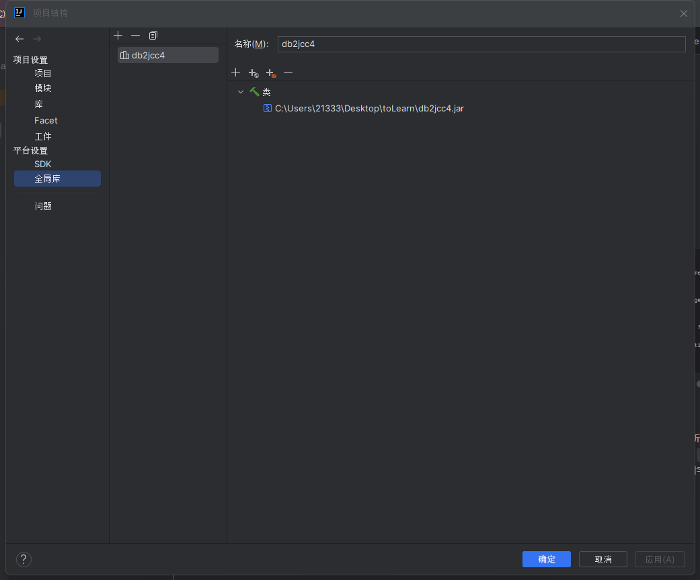
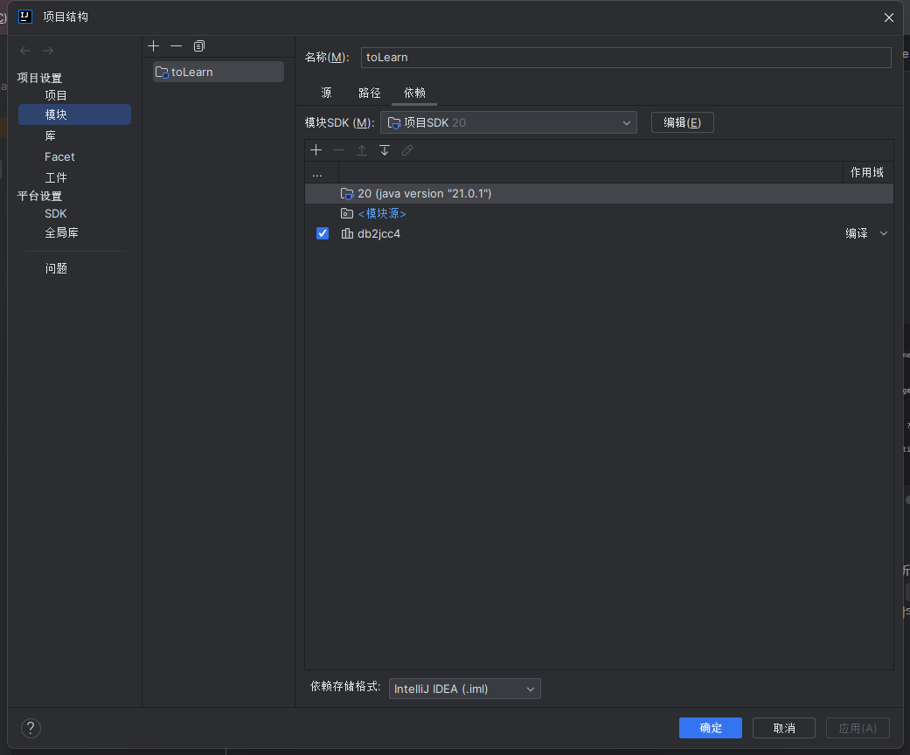
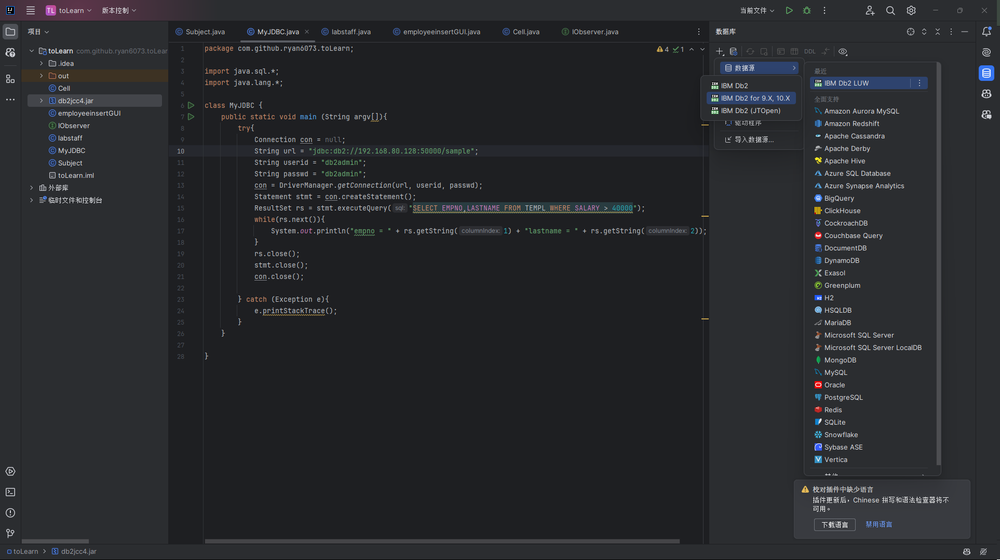
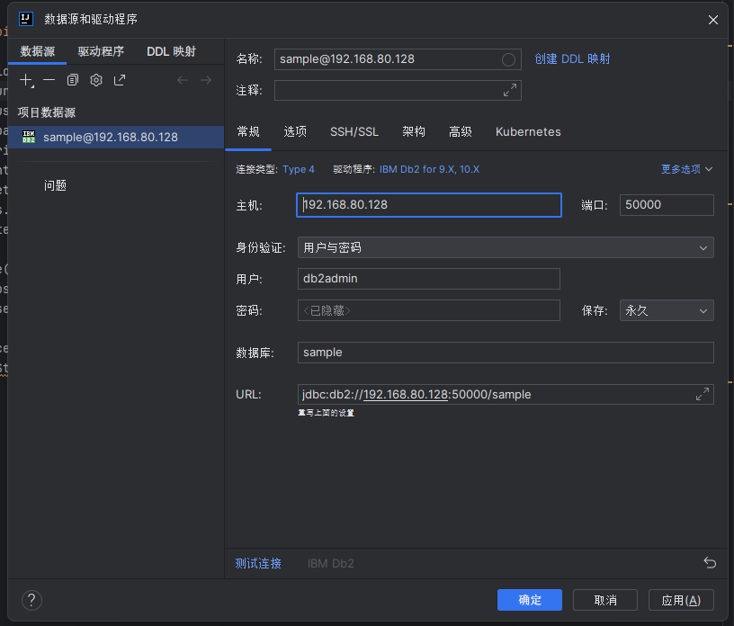
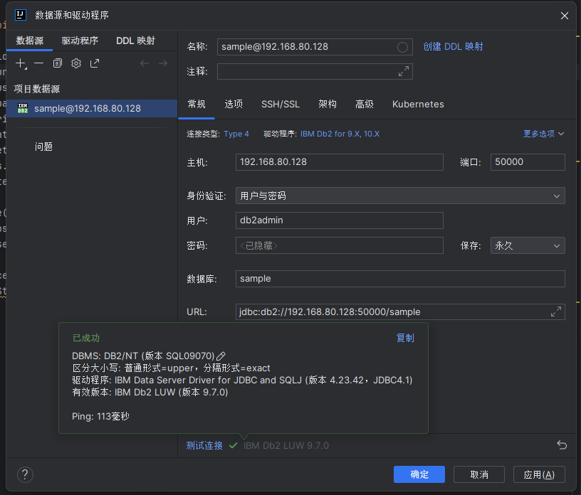
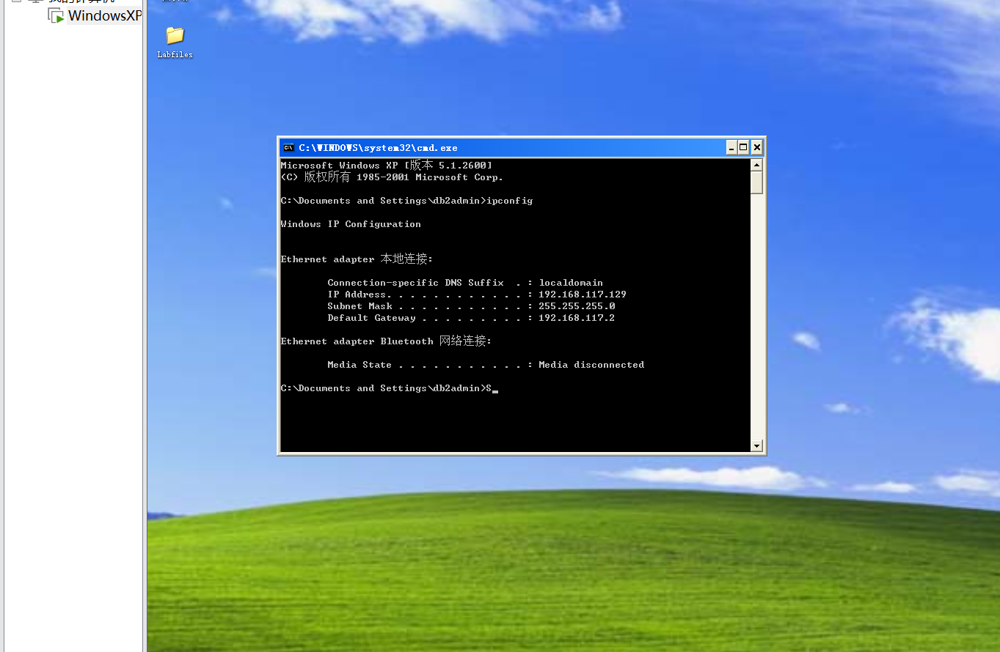
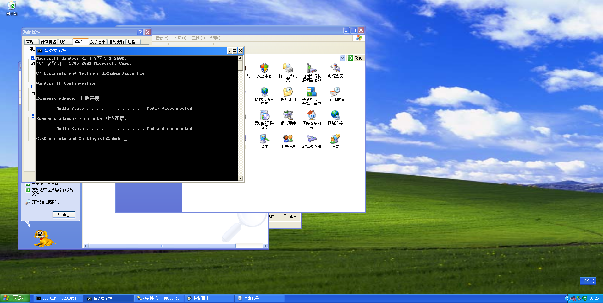
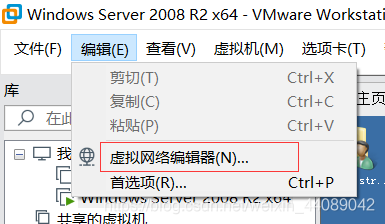
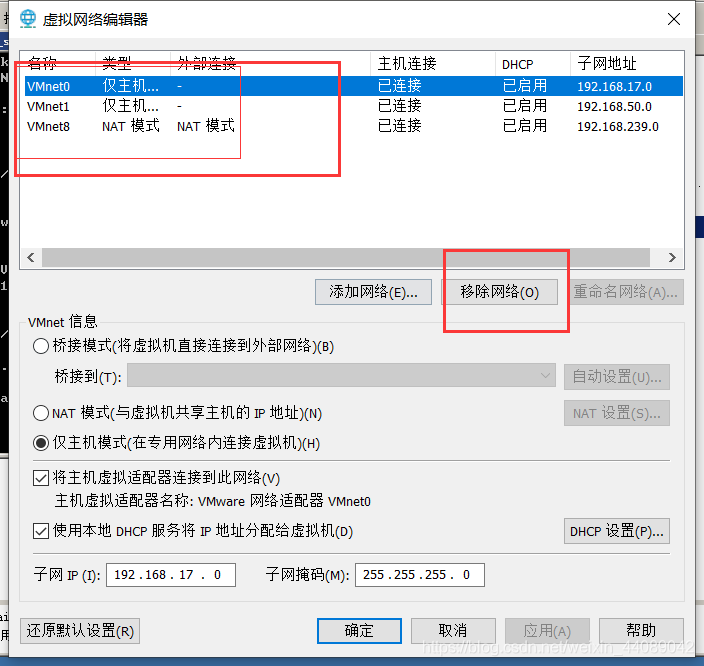
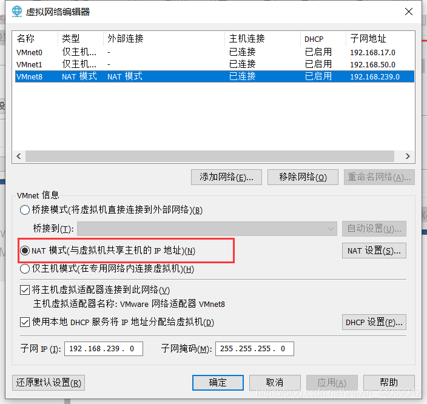

### 在IJ中远程连接虚拟机上的数据库（db2）

由于在上数据库应用程序开发课的时候,虚拟机的Java程序编译运行实在太过于麻烦，因此我最后选择了在IJ上连接db2进行操作。安装流程如下：

1. 在虚拟机上安装db2数据库，这个过程网上有很多教程，我就不赘述了。
2. 然后需要打开db2的服务器，具体步骤如下：
   1. 打开控制台，输入db2cmd，进入db2的命令行界面
   2. 输入db2start，启动db2服务器
3. 关闭虚拟机中的防火墙，具体步骤如下：
   1. 打开控制面板，选择Windows防火墙
   2. 选择关闭防火墙
   　　或者也可以在虚拟机中的cmd中输入netsh firewall set opmode disable，关闭防火墙
4. 在IJ中安装db2的驱动，具体步骤如下：
   1. 打开File->Project Structure->Global Library->点击+号->选择Java->选择db2jcc4.jar->点击OK（db2jcc4.jar这个jar包在官网上下载即可）
   2. 点击OK后，会在Global Library中看到db2jcc4.jar
   
   3. 然后在File->Project Structure->Modules->Dependencies->点击+号->选择JARs or directories->选择db2jcc4.jar->点击OK
   
   4. 点击OK后，会在Dependencies中看到db2jcc4.jar
   5. 然后找到数据库连接的地方，点击+号->选择Data Source->选择DB2->点击OK
   
   
   6. 然后在弹出的窗口中，输入数据库的用户名和密码，点击Test Connection，如果出现如下图所示的提示，则说明连接成功
   
   7. 注意，主机端口是虚拟机的主机端口，怎么获取，可以参考我下面的问题解决，因为下面的问题同样涉及到虚拟机ip的获取(在VMware中重新设置虚拟网络的时候会自动填入虚拟机IP地址，直接抄即可)

### 虚拟机显示有线网络已断开的解决方法

桌面右下角的网络连接显示断开，数据库自然也无法正常连接，解决方法如下：
   1. 点击虚拟机网络编辑器
      
   2. 移除三个网络，重新添加
      
      
   3. 添加完成之后，vment8设置为 NAT模式。 其他的设置为主机模式。
      
   4. 网络连接成功。

参考链接：

[虚拟机VMware网络断开，解决办法。_数据与虚拟机端口断开-CSDN博客](https://blog.csdn.net/weixin_44089042/article/details/111035121)
