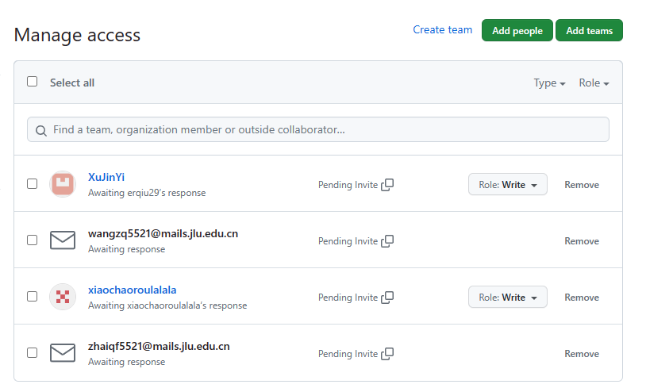
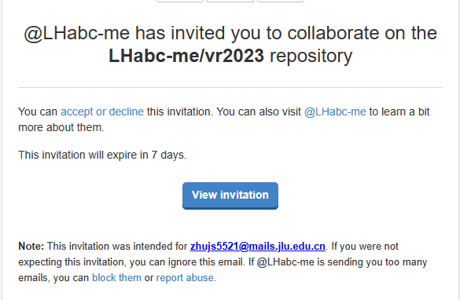

## Table of contents

## 加入协作

- 创建GitHub账户，建议用学生邮箱创建一个账户，记住自己的邮箱，我已经给你们的学生邮箱发了邮件，如果不是学生邮箱，把个人邮箱告诉我，我再发邀请

- 我会邀请你们加入协作，你们去吉林大学学生邮箱加入协作，你们会收到如下格式邮件：

## 配置SSH

[Git配置SSH-Key - 简书 (jianshu.com)](https://www.jianshu.com/p/dd3be8cb5b90)

## 提交和下载方法

[IDEA配置Git以及对Git的基本操作。 - 掘金 (juejin.cn)](https://juejin.cn/post/7246311040268222524)