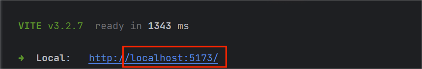
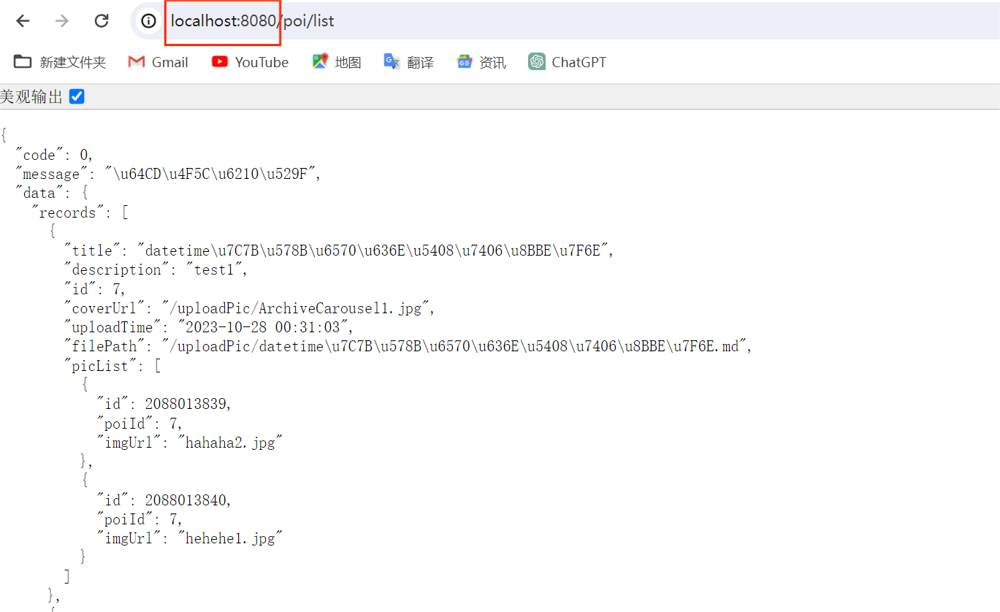
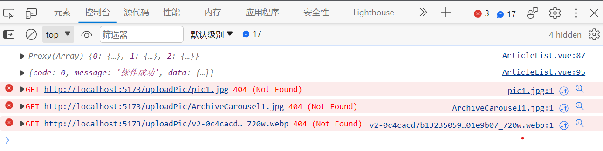

## Table of contents

## 1.  跨域

- 跨域是浏览器基于**同源策略**（Sameoriginpolicy）的一种安全手段。

- 同源（即在同一个域）：

    - 协议相同（protocol）
    - 域名相同（host）
    - 端口相同（port）

- 当三者中任意一个与当前页面的地址不同，就会产生**跨域**。

  >Notice：跨域是浏览器的限制，当使用抓包工具(eg.Postman)抓取接口数据时，能够看到接口已将数据返回，只是浏览器的限制使我们获取不到数据。


## 2.  如何解决跨域问题

### 2.1  发现跨域问题

这里以`vue`作为前端，`Spring boot`作为后端举例说明。

- 前端服务地址为：http://localhost:5173/



- 后端接口地址为：http://localhost:8080/



由于前后端通信的端口不一致，造成了跨域问题，控制台报错如下：



### 2.2  解决方法

常用的解决跨域问题的方法有：

- JSONP（淘汰）
- CORS
- Proxy

#### 2.2.1  配置Vite Proxy

在vue项目中，我们解决前后端跨域问题主要针对`Proxy`方案展开。不管是 `Vite`还是 `Webpack`，这些打包工具都支持设置前端代理，它们能够把对某一段 URL 的访问直接转换成另一个真实的后端 API 地址，这样前后端就视为使用了相同的域名、协议和端口，就避免了跨域的问题，还能避免繁琐的反复编写域名。

下面以Vite的代理配置为例，给API请求设置代理，具体设置参考Vite官方文档：[Vite Proxy配置](https://cn.vitejs.dev/config/server-options.html#server-proxy )

- 打开vite.config.ts配置文件，添加如下配置：

```typescript
//vite.config.ts

export default defineConfig({
  server: {
    proxy: {
      '/api': {
        target: 'http://localhost:8080',
        changeOrigin: true,
        rewrite: (path) => path.replace(/^\/api/, ""),
      }
    }
  }
})
```

- 通过axios发送请求，配置请求的根路径：

```typescript
const request = axios.create({
    baseURL: '/api',// 所有的请求地址前缀部分
})
```

在 vite 导出的配置里边：

- 添加`server` 配置项。
- 在 `server`配置项下边添加 `proxy`配置项，值为一个对象，属性名为要代理的 URL 路径段，值为相关的配置。
- 这里属性名设置为 `/api`，是访问后台接口的接口，来配置转发前端 `http://localhost:5173/api` 开头的所有请求路径。

在 proxy 配置对象中：

- `target`：为实际的后端 URL，它会追加到属性名配置的 `/api` 这个片段的前面，例如访问 `/api/end_point`会转换为 `http://localhost:8080/api/end_point`。
- `changeOrigin`：是否改写 origin，设置为 true 之后，就会把请求 API header 中的 origin，改成跟 `target` 里边的域名一样了。
- `rewrite`:可以把请求的 URL 进行重写，这里因为假设后端的 API 路径不带 `/api` 段，所以我们使用`rewrite`去掉 `/api`。给 `rewrite`传递一个函数，函数的参数 `path`是前端请求的 API 路径，后面直接使用了 replace() 方法，在里面写一个正则表达式，把 `/api`开头的这一段替换为空。

这样在实际前端请求的过程中，就可以直接使用`/api/end_point`这样的形式了，前面的http协议、域名和端口都可以忽略掉，并且解决了跨域问题。另外，代理可配置多个，根据不同的API路径去请求不同的后端路径。