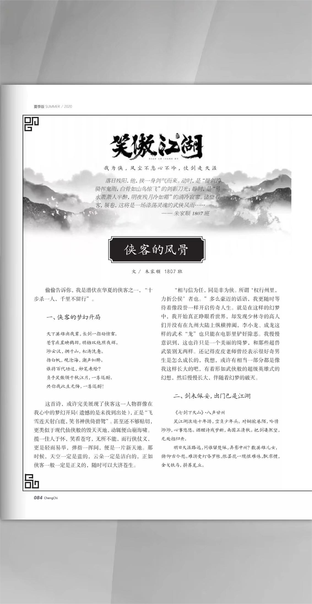
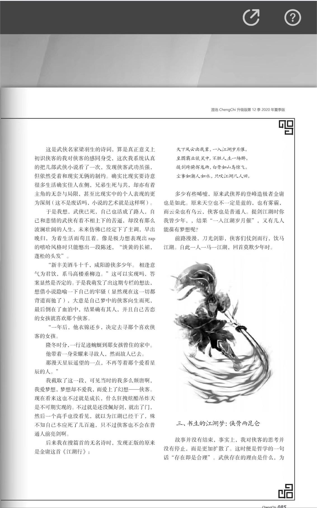
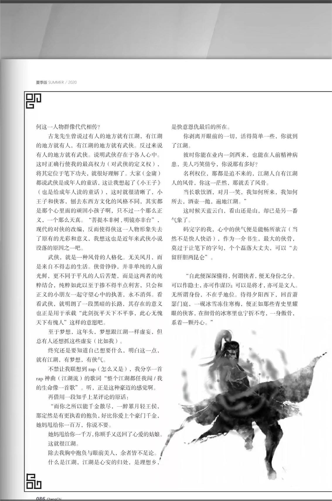
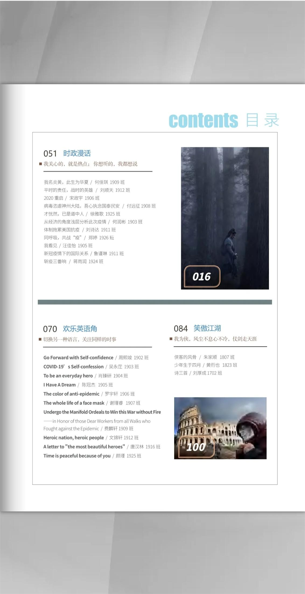

偷偷告诉你，我是潜伏在华夏的侠客之一，“十步杀一人，千里不留行”。

## 一、侠客的梦幻开局  

天下英雄出我辈，长剑一指动惊雷。

苍穹疾星映鹤羽，明铛双绝照夜辉。
渺云汉，拥千山，松涛洗惫。
扬白帆，观沧海，潮声似醉。
谁将百代功过，妙笔来绘？
负手笑傲领千秋江月，一尊还酹。
共你我此生无悔，一尊还酹！

这首诗，或许完美展现了侠客这一人物群像在我心中的梦幻开局（遗憾的是未找到出处），正是“飞雪连天射白鹿，笑书神侠倚碧鸳”。甚至还不够贴切，更类似于现代仙侠般的毁天灭地，动辄便山崩海啸。揽一佳人于怀，笑看苍穹，无所不能，而行侠仗义，更是轻而易举，弹指一挥间，便是一片新天地。那时候，天空一定是蓝的，云朵一定是洁白的，正如侠客一般一定是正义的，随时可以大济苍生。

“相与信为任，同是非为侠。所谓‘权行州里，力折公侯’者也。”多么豪迈的话语，我更随时等待着像段誉一样开启传奇人生。就是在这样的幻梦中，我开始真正睁眼看世界，却发现少林寺的高人们并没有在九州大陆上纵横捭阖，李小龙、成龙这样的武术“龙”也只能在电影里铲奸除恶。我慢慢意识到，这也许只是一个美丽的绮梦，和那些超兽武装别无两样。还记得皮皮老师曾经表示很好奇男生是怎么成长的，我想，或许有相当一部分都是像我这样长大的吧，有着形如武侠般的超级英雄式的幻想，然后慢慢长大，伴随着幻梦的破灭。

## 二、剑未佩妥，出门已是江湖

《七剑下天山》·八声甘州

笑江湖浪迹十年游，空负少年头。对铜驼巷陌，吟情渺渺，心事悠悠。酒醒诗残梦断，南国正清秋。把剑凄然望，无处招归舟。
明日天涯路远，问谁留楚佩，弄影中州？数英雄儿女，俯仰古今愁。难消受灯昏罗帐，怅昙花一现恨难休，飘零惯，金戈铁马，拼葬荒丘。

这是武侠名家梁羽生的诗词，算是真正意义上初识侠客的我对侠客的感同身受，这次我系统认真的把几部武侠小说看了一次，发现侠客武功虽强，但依然受着和现实无俩的制约。确实比现实要诗意很多，生活确实佳人在侧，兄弟生死与共，却亦有着主角的无奈与局限，甚至比现实中的个人表现的更为深刻（这不是废话吗，小说的艺术就是这样啊）。

于是我想，武侠已死，自己也活成了路人，自己和悲情的武侠有着不相上下的苦逼，却没有那么波澜壮阔的人生，未来仿佛已经定下了主调，早出晚归，为着生活而苟且着。像是极力想表现出rap的嘻哈风格时只能憋出一段陈述，“淡黄的长裙，蓬松的头发”。

“新丰美酒斗十千，咸阳游侠多少年。相逢意气为君饮，系马高楼垂柳边。”这可以实现吗，答案显然是否定的。于是我萌发了出这期专栏的想法，想借小说隐喻一下自己的牢骚（显然现在这一切都背道而驰了)，大意是自己梦中的侠客向生而死，最后倒在了血泊中，结果确有其人，并且自己苦恋的女孩就喜欢那个侠客。

“一年后，他衣锦还乡，决定去寻那个喜欢侠客的女孩。

隆冬时分，一行足迹蜿蜒到那女孩曾住的家中。

他带着一身荣耀来寻故人，然而故人已去。

那漫天星辰遥望的一点，不再等着那个爱看星辰的人。”

我截取了这一段，可见当时的我多么颓唐啊，我爱梦想，梦想却不爱我，而爱上了幻想——侠客。现在看来这也不过就是成长，什么狂拽炫酷吊炸天是不可期实现的。不过就是还没佩好剑，就出了门，然后一个高手也没看见，就以为江湖已经干了，殊不知自己本应死了几百遍，只不过侠客也不会在普通人前亮剑啊。

后来我在搜篇首的无名诗时，发现正版的原来是金庸这首《江湖行》：

天下风云出我辈，一入江湖岁月催。

皇图霸业谈笑中，不胜人生一扬醉。
提剑跨骑辉鬼雨，白骨如山鸟惊飞。
尘事如潮人如水，只叹江湖几人回。

多少有些唏嘘，原来武侠界的登峰造极者金庸也是如此。原来天空也不一定是蓝的，也有雾霾，而云朵也有乌云，侠客也是普通人。提剑江湖时你我皆少年，，结果“一入江湖岁月催”，又有几人能葆有梦想呢？
前路漫漫，刀光剑影，侠客们仗剑而行，饮马江湖。自此一人一马一江湖，回首莫欺少年时。

## 三、书生的江湖梦：侠骨两昆仑
故事并没有结束，事实上，我对侠客的思考并没有停止，而是更加扩散了。这时便是哲学的一句话“存在即是合理”。武侠存在的理由是什么，为何这一人物群像代代相传？

古龙先生曾说过有人的地方就有江湖，有江湖的地方就有人，有江湖的地方就有武侠。反过来说有人的地方就有武侠。说明武侠存在于各人心中。这时正确行使我的最高权力（对式侠的定义权）将其定位于笔下功夫，就很好理解了。大家（金庸）都说武侠是成年人的童话，这让我想起了《小王子》（也是给成年人读的童话），这时就很清晰了，小王子和侠客，刨去东西方文化的风格不同。其实都是那个心里面的顽固小孩子啊，只不过一个那么正义，一个那么天真。“若提本非树，明镜亦非台”，现代的对侠的改编，反面使得侠这一人物形象失去了原有的光彩和意义，我想这也是近年来武侠小说没落的原因之一吧。

武侠，就是一种风骨的人格化。无关风月，而是来自不得志的生活。侠骨铮铮，并非单纯的人前光鲜，更不同于平凡的人后苦楚，而是这两者的纯粹结合，纯粹如此以至于掺不得半点利害，只会和正义的小朋友一起守望心中的执著，永不消弭。看看武侠。就明朗了一段黑暗的长路。其存在的意义也正是用于承载“此剑抚平天下不平事，此心无愧天下有愧人”这样的意愿吧。

至于梦想，这年头，梦想跟江湖一样虚妄，但总有人还想抓这些虚妄（比如我）。

终究还是要知道自己想要什么，明白这一点，就有江湖，有梦想，有侠气。

不禁让我联想到rap(怎么又是)，我分享一首 rap神曲（江湖流）的歌河“整个江湖都任我闯/我的生命像一首歌”。听，正是这种豪迈的感觉啊。

再借用一段知乎上某评论的原话：

“而你之所以能千金散尽，一醉累月轻王侯，那定然是有更执着的泡负，好比你爱上个豪门千金，她妈甩给你一百万，你说不要。

她妈甩给你一千万，你顺手又送回了心爱的姑娘。

这就很江湖。

除去我胸中抱负与眼前美人，余者皆不足论。

什么是江湖，江湖是心安的归处，是理想乡，是快意恩仇最后的所在。

你剥离开眼前的一切，活得简单一些，你就到了江湖。

彼时你能在业内一剑西来，也能在人前精神病患，美人巧笑倩兮，你说那有多好？

名利权位，那都是追不来的，江湖人自有江湖人的风骨，你这一茫然，那就丢了风骨。

当长歌饮酒，对月一笑，我知何所来，我知何所去，酒壶一抛，遍地江湖。”

这时候天蓝云白，看山还是山，却已是另一番气象了。

码完字的我，心中的侠气便是能畅所欲言（当然不是快人快语)，作为一介书生，最大的侠骨，莫过于让笔下的字句，个个磊落大丈夫，可以“去留肝胆两昆仑”。

“自此便深深懂得，何谓侠者，便无身份之分。可以作隐士，亦可作谋臣：可以是将才，亦可是文人无所谓身份，不在乎地位。待得夕阳西下，回首萧瑟门庭，一砚冰雪冻住寒梅，便正如那些青史里耀眼的侠客，在彻骨的冰寒里也宁折不弯，一身傲骨，系着一颗丹心。”

