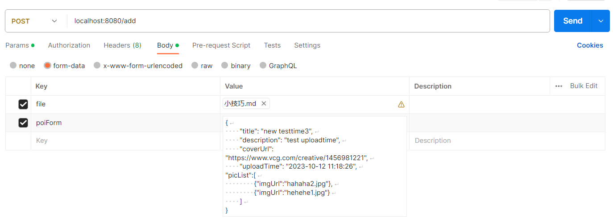
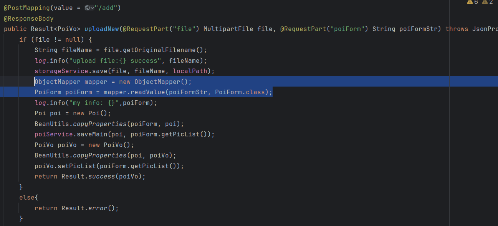

现在要传输这样的数据，并且要解析json数据获得真正需要的Java对象数据，需要将json格式数据以string类型传入后端再进行解析：



通过使用一个JSON解析库（Jackson）而不是直接使用Blob。

```java
import com.fasterxml.jackson.databind.ObjectMapper;

// ...

ObjectMapper mapper = new ObjectMapper();
PoiForm poiForm = mapper.readValue(poiFormStr, PoiForm.class);
```

