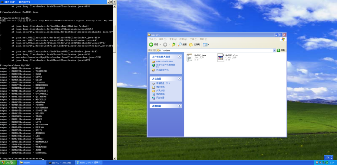

##### 1: MyJDBC（本系统登录）

```java
import java.sql.*;
import java.io.*;
import java.lang.*;

class MyJDBC {
    static {
        try { Class.forName("COM.ibm.db2.jdbc.app.DB2Driver");
        } catch (Exception e){
            e.printStackTrace();
        }
    }
    public static void main (String[] argv){
        try{
            Connection con = null;
            String url = "jdbc:db2:sample";
            if(argv.length == 0){
                con = DriverManager.getConnection(url);
            } else if(argv.length == 2){
                String userid = argv[0];
                String passwd = argv[1];
                con = DriverManager.getConnection(url, userid, passwd);
            } else{
                throw new Exception("\n Usage: java MyJDBC \n or: java MyJDBC <userid> <passwd>\n");
            }
            Statement stmt = con.createStatement();
            ResultSet rs = stmt.executeQuery("SELECT EMPNO,LASTNAME FROM TEMPL WHERE SALARY > 40000");
            while(rs.next()){
                System.out.println("empno = " + rs.getString(1) + "lastname = " + rs.getString(2));
            }
            rs.close();
            stmt.close();
            con.close();
            
        } catch (Exception e){
            e.printStackTrace();
        }
    }
    
}
```

##### 2：JDBC（异系统登录）

```java
import java.sql.*;
import java.lang.*;

class MyJDBC {
    public static void main (String[] argv){
        try{
            Connection con = null;
            String url = "jdbc:db2://192.168.80.128:50000/sample";
            String userid = "db2admin";
            String passwd = "db2admin";
            con = DriverManager.getConnection(url, userid, passwd);
            Statement stmt = con.createStatement();
            ResultSet rs = stmt.executeQuery("SELECT EMPNO,LASTNAME FROM TEMPL WHERE SALARY > 40000");
            while(rs.next()){
                System.out.println("empno = " + rs.getString(1) + "lastname = " + rs.getString(2));
            }
            rs.close();
            stmt.close();
            con.close();

        } catch (Exception e){
            e.printStackTrace();
        }
    }

}
```
运行结果：

主要要注意我们异系统登录操作肯定是要用远程用户的，所以可以直接省略使用本地用户的情况。

rs是游标，就像查询语句的指针，stmt是定义的查询语句，这里符合MYSQL的SQL方言，con是一个数据库连接对象。