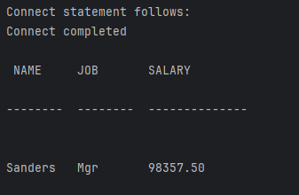

##### 2: labstaff

```java
import java.sql.*;
import java.io.*;
import java.util.*;
import java.math.*;

/**********************************************************************/
/* Class definition                                                   */

import java.io.BufferedReader;
import java.io.InputStreamReader;
import java.sql.SQLException;

public class labstaff
{
    static {
        try {   Class.forName ("COM.ibm.db2.jdbc.app.DB2Driver");
    } catch (Exception e) {   System.out.println ("\n  Error loading DB2 Driver...\n");
        System.out.println (e);
        System.exit(1);
        }
    }
    public static void main( String args[]) throws Exception
    {
        String name = "";                       // Character string for employee name
        String deptno = "";                     // Character string for department number
        short id = 0;                           // Short for employee ID
        String salary = " ";                   // Character string for salary
        String job = "";                        // Character string for job title
        short NumEmp = 0;                      // Short for the number of employees

        /* Header line                                                         */
        String intext =
                "\n NAME     JOB       SALARY\n";
        String indash =
                "--------  --------  --------------\n";
        String blanks = "                                                        ";

        BufferedReader in = new BufferedReader(new InputStreamReader(System.in));
        String s;

        /*  Establish connection and set default context  */
        System.out.println("Connect statement follows:");
        /* (1) Code a Connect statement */
        Connection sample = DriverManager.getConnection("jdbc:db2:sample");
        System.out.println("Connect completed");
        sample.setAutoCommit(false);

        /*  Print instruction lines */
        System.out.println(intext);
        System.out.println(indash);

        /*  Issue Select statement  */
        try {
            Statement stmt = sample.createStatement();
            ResultSet rs = stmt.executeQuery("select NAME, JOB, SALARY from JLU.STAFF Where ID = 10");
            boolean more = rs.next();
            while (more) {
                name = rs.getString(1);
                job = rs.getString(2);
                salary = rs.getString(3);
                String outline = (name + blanks.substring(0, 10 - name.length())) +
                        (job + blanks.substring(0, 10 - job.length())) +
                        (salary + blanks.substring(0, 12 - salary.length()));
                System.out.println("\n" + outline);
                /* (5) Move to the next row of the resultset */
                more = rs.next();
            }
        } // end try
        catch (SQLException x) {
            System.out.println("Error on call " + x.getErrorCode() +
                    " and sqlstate of " + x.getSQLState() + " message " + x.getMessage());
        }
        System.exit(0);
}
}

```
如上同样是在XP系统上运行的代码，如果要在win11上运行，只需要注意url,NAT到虚拟机的IP即可：就是执行数据库连接那一行代码（url）:

```java
Connection sample = DriverManager.getConnection("jdbc:db2://192.168.80.128:50000/sample", "db2admin", "db2admin");
```

运行结果：


这一题需要注意这几个点：
1. 注意记忆几个重要语句：

   ```java
   //数据库登录语句
   Connection sample = DriverManager.getConnection("jdbc:db2://192.168.80.128:50000/sample", "db2admin", "db2admin");
   
   //创建数据库执行语句
   Statement stmt = sample.createStatement();
   
   //用游标rs，遍历数据库，依次打印出查询语句的结果
   ResultSet rs = stmt.executeQuery("select NAME, JOB, SALARY from JLU.STAFF Where ID = 10");
   ```
2. 注意一个语句的作用：
   
   ```java
   //设置自动提交为false，此时修改要完成需要手动提交
   sample.setAutoCommit(false);
   ```
   