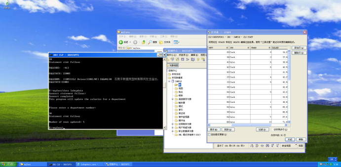
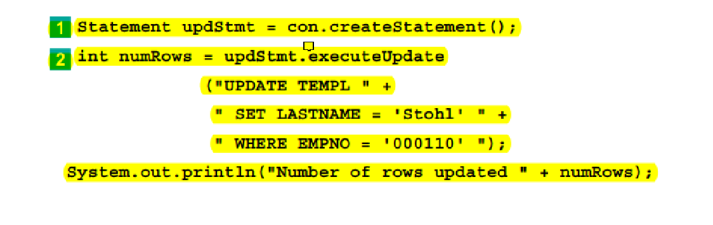
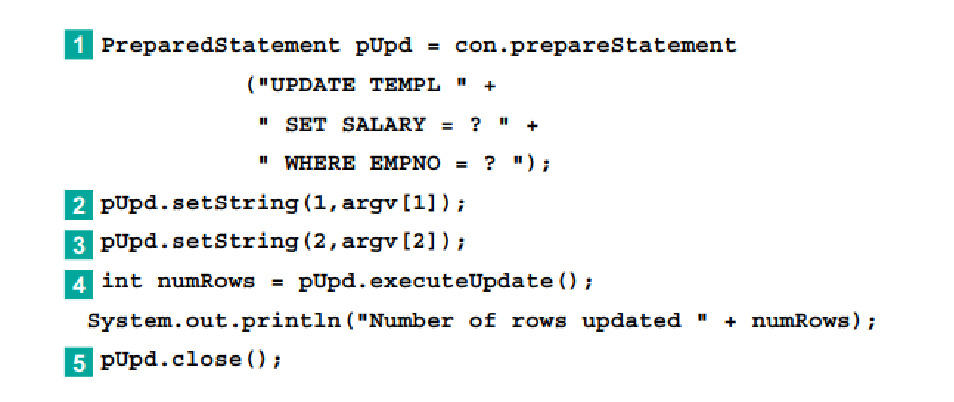
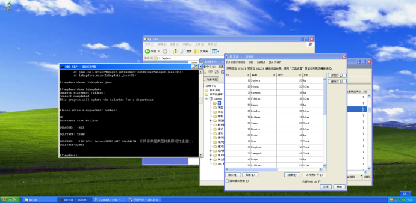
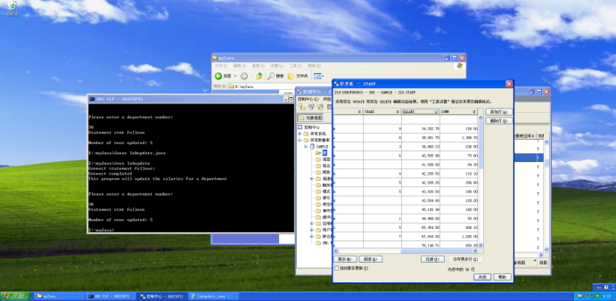

##### 3: labupdate

```java
import java.sql.*;
import java.io.*;
import java.util.*;
import java.math.*;

public class labupdate {
static {
        try {
            Class.forName("COM.ibm.db2.jdbc.app.DB2Driver");
        } catch (Exception e) {
            System.out.println("\n  Error loading DB2 Driver...\n");
            System.out.println(e);
            System.exit(1);
        }
    }

    public static void main(String args[]) throws Exception {
        String deptno = "";
        int updateCount = 0;
        String sqlstmt = "UPDATE JLU.STAFF SET SALARY = SALARY * 1.05 WHERE DEPT = ?";
        BufferedReader in = new BufferedReader(new InputStreamReader(System.in));

        System.out.println("Connect statement follows:");

        Connection sample = DriverManager.getConnection("jdbc:db2:sample", "db2admin", "db2admin");
        System.out.println("Connect completed");

        /****************** Turn autocommit to off **************************/
        /* ( 4 ) Turn autocommit to off                                      */
        /*********************************************************************/
        sample.setAutoCommit(false);

        /* Print instruction lines */
        System.out.println("This program will update the salaries for a department");
        System.out.println("\n");
        System.out.println("Please enter a department number: \n");

        /* Get the department number from the input data */
        deptno = in.readLine().trim();

        /* Issue Select statement */
        System.out.println("Statement stmt follows");
        try {
            /****************** Create the PreparedStatement object ************/
            /* ( 5 ) Create the PreparedStatement object named pstmt using the */
            /* prepareStatement method                                        */
            /*******************************************************************/
            PreparedStatement pstmt = sample.prepareStatement(sqlstmt);

            /****************** Set the parameter marker **********************/
            /* (6) Set the parameter marker to be value of the department.    */
            /*     This value is placed in the field deptno                   */
            /*******************************************************************/
            pstmt.setString(1, deptno);

            /****************** Execute the SQL statement *********************/
            /* (7) Execute the SQL statement                                  */
            /*     The number of rows modified by the update statement should */
            /*     be saved in the variable named updateCount                 */
            /*******************************************************************/
            updateCount = pstmt.executeUpdate();
	        sample.commit();

            System.out.println("\nNumber of rows updated: " + updateCount);
        } // end try
        catch (SQLException x) {
            /****************** Handle SQL Exception **************************/
            /* (8) An error has occurred. Retrieve the SQLCode                */
            /*******************************************************************/
            int SQLCode = x.getErrorCode();
            String SQLState = x.getSQLState();
            String Message = x.getMessage();
            System.out.println("\nSQLCODE:  " + SQLCode);
            System.out.println("\nSQLSTATE: " + SQLState);
            System.out.println("\nSQLERRM:  " + Message);
        }

        System.exit(0);
    } // end main
}  // end of labupdate class


```

这里前面的取消自动提交语句就起作用了，防止了更新失败后的数据丢失。

运行结果：


需要注意的几个点：
1. 由于是更新操作，所以需要使用`executeUpdate()`方法，而不是`executeQuery()`方法。

   ```java
   //创建PreparedStatement对象
   PreparedStatement pstmt = sample.prepareStatement(sqlstmt);
   
   //设置参数
   pstmt.setString(1, deptno);
   
   //整型变量updateCount用于保存更新的行数
   updateCount = pstmt.executeUpdate();
   ```

2. 这里出现了手动提交的操作，在完成所有的更新操作后，需要使用`commit()`方法进行提交。

   ```java
   sample.commit();
   ```
   
3. 错误处理，这一点在实验二就有出现，但是在实验3才算正式使用

   ```java
   catch (SQLException x) {
            int SQLCode = x.getErrorCode();
            String SQLState = x.getSQLState();
            String Message = x.getMessage();
            System.out.println("\nSQLCODE:  " + SQLCode);
            System.out.println("\nSQLSTATE: " + SQLState);
            System.out.println("\nSQLERRM:  " + Message);
        }
   ```
   
4. 用设置参数的方式，代码更加灵活，方便用户与程序进行交互。

   ```java
   pstmt.setString(1, deptno);
   ```
   
   
5. 关于正常执行，返回0行和溢出：“salary”列被定义为“DECIMAL(10,2)”，这意味着它最多可以存储10位数字，其中包括小数点的后两位，如果薪水增加后的值超过了这个范围，就会发生溢出错误。如果返回0行，则是没有手动提交更新内容，导致操作无效，返回更新行数变成0行。
   
   