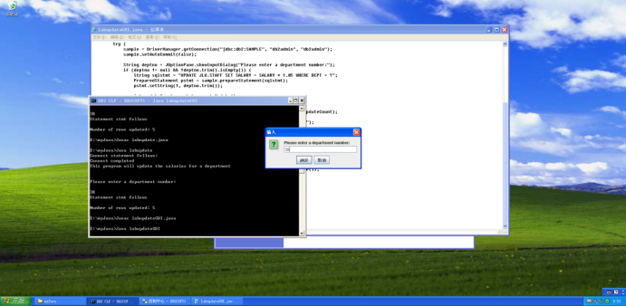
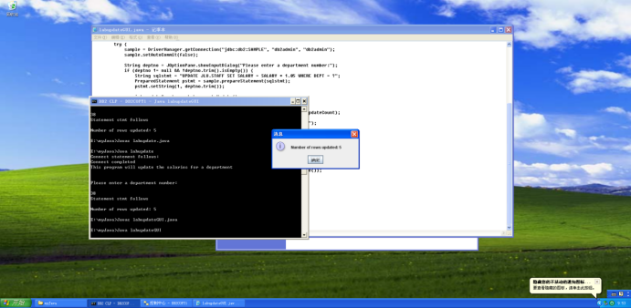

##### 4: labupdateGUI

```java
import javax.swing.JOptionPane;
import java.sql.*;

public class labupdateGUI {

    static {
        try {
            Class.forName("COM.ibm.db2.jdbc.app.DB2Driver");
        } catch (Exception e) {
            JOptionPane.showMessageDialog(null, "Error loading DB2 Driver...\n" + e);
            System.exit(1);
        }
    }

    public static void main(String args[]) {
        Connection sample = null;
        try {
            sample = DriverManager.getConnection("jdbc:db2:SAMPLE", "db2admin", "db2admin");
            sample.setAutoCommit(false);

            String deptno = JOptionPane.showInputDialog("Please enter a department number:");
            if (deptno != null && !deptno.trim().isEmpty()) {
                String sqlstmt = "UPDATE JLU.STAFF SET SALARY = SALARY * 1.05 WHERE DEPT = ?";
                PreparedStatement pstmt = sample.prepareStatement(sqlstmt);
                pstmt.setString(1, deptno.trim());

                int updateCount = pstmt.executeUpdate();
                sample.commit(); // Commit the transaction

                JOptionPane.showMessageDialog(null, "Number of rows updated: " + updateCount);
            } else {
                JOptionPane.showMessageDialog(null, "No department number entered.");
            }
        } catch (SQLException x) {
            try {
                if (sample != null) sample.rollback(); // Rollback in case of an error
            } catch (SQLException e) {
                // Handle potential rollback error
            }
            JOptionPane.showMessageDialog(null, "SQL Error:\nSQLCODE: " + x.getErrorCode() +
                    "\nSQLSTATE: " + x.getSQLState() + "\nMessage: " + x.getMessage());
        } finally {
            try {
                if (sample != null) sample.close();
            } catch (SQLException e) {
                // Handle potential close error
            }
        }
    }
}

```

运行结果：



需要注意的地方在于：
1. 这里开始了GUI操作，需要会一些GUI相关代码的编写。在引用库来说，需要引用`javax.swing.JOptionPane`和`java.sql.*`，都需要有点印象。
   
   ```java
    import javax.swing.JOptionPane;
    import java.sql.*;
    ......
    s = JOptionPane.showInputDialog(null,"请输入要修改的部门编号： ");
    ......
    JOptionPane.showMessageDialog(null,"成功修改了"+updateCount+"条记录");
   ```