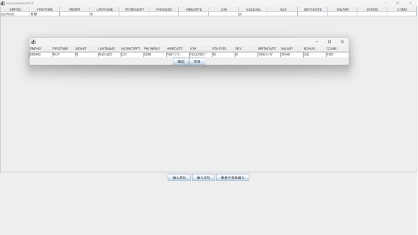
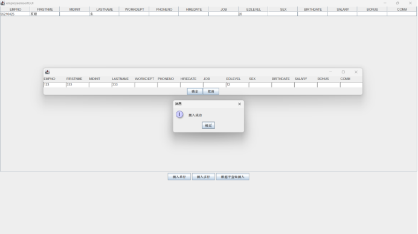
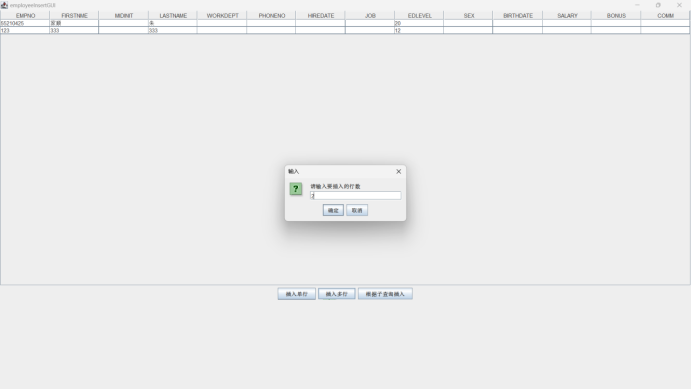
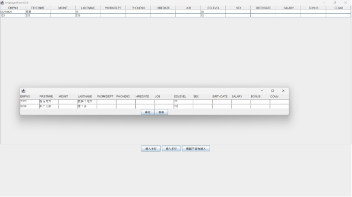
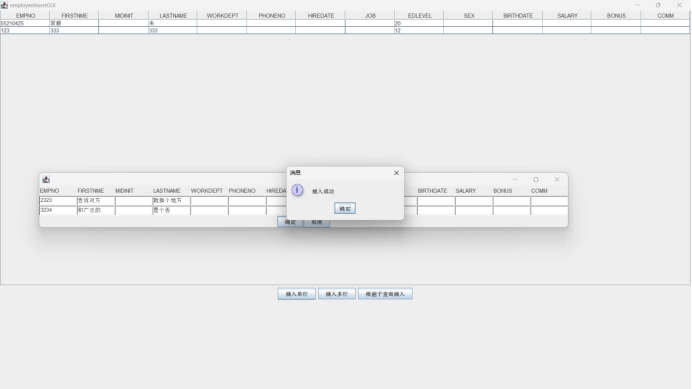
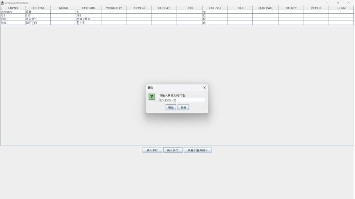
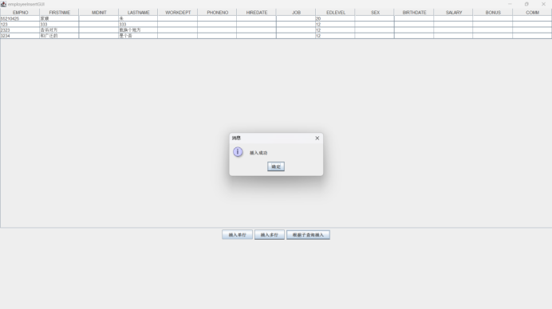
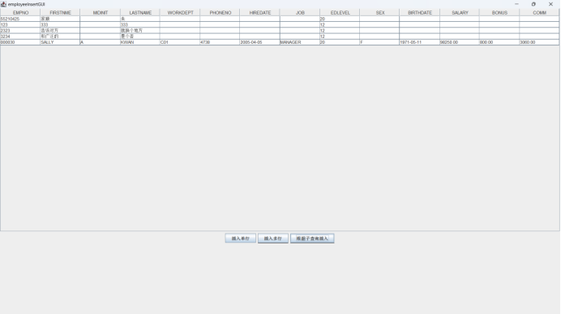
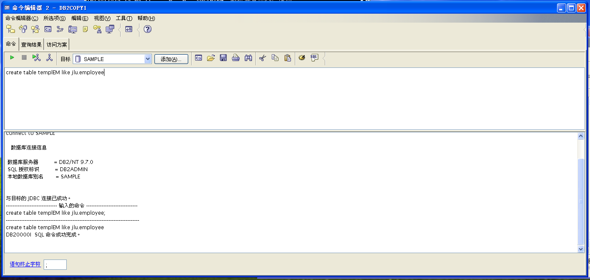
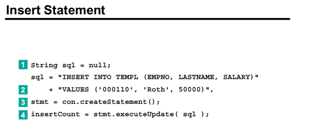

##### 5: employeeinsertGUI 

```java

import javax.swing.*;
import java.awt.*;
import java.sql.*;
import java.util.ArrayList;

public class employeeInsertGUI {
    ArrayList<String> columns;
    ArrayList<String> types;
    Connection connection;
    ArrayList<ArrayList<String>> dataToInsert;
    ArrayList<ArrayList<String>> data;
    String table;
    JTable dataTable;

    public employeeInsertGUI() {
        connection = connectToDB();
        table = "TEMPLEM";
        dataTable = new JTable();
        reloadData();
        showDataTable();
    }

    private void reloadData() {
        try {
            Statement statement = connection.createStatement();
            ResultSet resultSet = statement.executeQuery("SELECT * FROM " + table);
            // 获取列名
            ResultSetMetaData metaData = resultSet.getMetaData();
            int columnCount = metaData.getColumnCount();
            columns = new ArrayList<>();
            for (int i = 0; i < columnCount; i++) {
                columns.add(metaData.getColumnName(i + 1));
            }
            // 获取列类型
            types = new ArrayList<>();
            for (int i = 0; i < columnCount; i++) {
                types.add(metaData.getColumnTypeName(i + 1));
            }
            // 获取数据
            data = new ArrayList<>();
            while (resultSet.next()) {
                ArrayList<String> row = new ArrayList<>();
                for (int i = 0; i < columnCount; i++) {
                    row.add(resultSet.getString(i + 1));
                }
                data.add(row);
            }
            reloadDataTable();
        } catch (Exception e) {
            JOptionPane.showMessageDialog(null, e.getMessage());
        }
    }

    private Connection connectToDB() {
        try {
            Class.forName("com.ibm.db2.jcc.DB2Driver");
            connection = DriverManager.getConnection(
                    "jdbc:db2://192.168.80.128:50000/sample",
                    "db2admin",
                    "db2admin"
            );
        } catch (Exception e) {
            JOptionPane.showMessageDialog(null, "连接数据库失败：" + e.getMessage());
        }
        return connection;
    }

    // 插入任意条记录
    private void insertRows(String table) {
        try {
            Statement statement = connection.createStatement();
            // 批量插入
            for (ArrayList<String> row : dataToInsert) {
                StringBuilder sql = new StringBuilder("INSERT INTO " + table + " VALUES (");
                for (int i = 0; i < row.size(); i++) {
                    if (row.get(i).isEmpty()) {
                        sql.append("NULL");
                    } else if (types.get(i).equals("VARCHAR")) {
                        sql.append("'").append(row.get(i)).append("'");
                    } else {
                        sql.append(row.get(i));
                    }

                    if (i != row.size() - 1) {
                        sql.append(", ");
                    }
                }
                sql.append(")");
                System.out.println(sql);
                statement.addBatch(sql.toString());
            }
            statement.executeBatch();
            connection.commit();
            JOptionPane.showMessageDialog(null, "插入成功");

            // 刷新数据
            reloadData();
        } catch (Exception e) {
            JOptionPane.showMessageDialog(null, "插入失败：" + e.getMessage());
        }
    }

    private void reloadDataTable() {
        Object[][] data;
        if (!this.data.isEmpty()) {
            data = new Object[this.data.size()][this.data.getFirst().size()];
            for (int i = 0; i < this.data.size(); i++) {
                for (int j = 0; j < this.data.get(i).size(); j++) {
                    data[i][j] = this.data.get(i).get(j);
                }
            }
        } else {
            data = new Object[0][0];
        }
        dataTable.setModel(new javax.swing.table.DefaultTableModel(
                data,
                columns.toArray()
        ));
    }

    private void showDataTable() {
        JFrame frame = new JFrame("employeeInsertGUI");
        JPanel panel = new JPanel();

        JScrollPane scrollPane = new JScrollPane(dataTable);
        scrollPane.setSize(800, 800);
        panel.add(scrollPane);

        // 插入按钮
        Panel buttonPanel = getChoosePanel();
        panel.add(buttonPanel);

        panel.setLayout(new BoxLayout(panel, BoxLayout.Y_AXIS));

        frame.setContentPane(panel);
        frame.setDefaultCloseOperation(JFrame.EXIT_ON_CLOSE);
        frame.pack();
        frame.setVisible(true);
    }

    private Panel getChoosePanel() {
        JButton insertButton = new JButton("插入单行");
        JButton insertMultiButton = new JButton("插入多行");
        JButton insertBySubqueryButton = new JButton("根据子查询插入");

        // 绑定事件
        insertButton.addActionListener(e -> handleInsertButton());
        insertMultiButton.addActionListener(e -> handleInsertMultiButton());
        insertBySubqueryButton.addActionListener(e -> handleInsertBySubqueryButton());

        // 将按钮添加到面板
        Panel buttonPanel = new Panel();
        buttonPanel.add(insertButton);
        buttonPanel.add(insertMultiButton);
        buttonPanel.add(insertBySubqueryButton);
        return buttonPanel;
    }

    private void showInsertMultiGUI(int rowCount) {
        JFrame frame = new JFrame();
        JPanel panel = new JPanel();
        JPanel labels = new JPanel();// 列名
        JPanel[] inputs = new JPanel[rowCount]; // 输入框
        for (String column : columns) {
            labels.add(new Label(column));
        }
        for (int i = 0; i < rowCount; i++) {
            inputs[i] = new JPanel();
            for (int j = 0; j < columns.size(); j++) {
                inputs[i].add(new TextField());
            }
        }
        panel.add(labels);
        for (int i = 0; i < rowCount; i++) {
            panel.add(inputs[i]);
        }

        labels.setLayout(new GridLayout(0, labels.getComponentCount()));
        for (int i = 0; i < rowCount; i++) {
            inputs[i].setLayout(new GridLayout(0, inputs[i].getComponentCount()));
        }
        panel.setLayout(new BoxLayout(panel, BoxLayout.Y_AXIS));

        // 添加确定按钮和取消按钮
        JButton confirmButton = new JButton("确定");
        JButton cancelButton = new JButton("取消");
        confirmButton.addActionListener(e -> {
            dataToInsert = new ArrayList<>();
            for (int i = 0; i < rowCount; i++) {
                ArrayList<String> row = new ArrayList<>();
                for (int j = 0; j < columns.size(); j++) {
                    row.add(((TextField) inputs[i].getComponent(j)).getText());
                }
                dataToInsert.add(row);
            }
            insertRows(table);
            frame.dispose();
        });
        cancelButton.addActionListener(e -> frame.dispose());
        JPanel buttonPanel = new JPanel();
        buttonPanel.add(confirmButton);
        buttonPanel.add(cancelButton);
        panel.add(buttonPanel);
        buttonPanel.setLayout(new BoxLayout(buttonPanel, BoxLayout.X_AXIS));

        panel.setLayout(new BoxLayout(panel, BoxLayout.Y_AXIS));
        frame.setContentPane(panel);
        frame.pack();
        frame.setVisible(true);
    }

    private void handleInsertButton() {
        showInsertMultiGUI(1);
    }

    private void handleInsertMultiButton() {
        // 获取用户输入
        String input = JOptionPane.showInputDialog("请输入要插入的行数");
        if (input == null) {
            return;
        }
        int rowCount = Integer.parseInt(input);
        showInsertMultiGUI(rowCount);
    }

    private void handleInsertBySubqueryButton() {
        // 获取用户输入的子查询条件
        String subqueryCondition = JOptionPane.showInputDialog("请输入子查询条件");
        if (subqueryCondition == null) {
            return;
        }
        try {
            Statement statement = connection.createStatement();
            // 构建完整的插入语句，使用子查询从 EMPLOYEE 表中选择数据
            String sql = "INSERT INTO " + table + " SELECT * FROM JLU.EMPLOYEE WHERE " + subqueryCondition;
            statement.executeUpdate(sql);
            JOptionPane.showMessageDialog(null, "插入成功");
        } catch (Exception e) {
            JOptionPane.showMessageDialog(null, "插入失败：" + e.getMessage());
        }
        reloadData();
    }


    public static void main(String[] args) {
        new employeeInsertGUI();
    }
}

```
运行结果：
插入单行:





插入多行：







子查询插入:







首先我们需要在数据库里新建一个表templ，但是这个时候会出现一个问题，就是之前有一个别名也叫templ,这个时候出现了冲突，老师给出的方案是修改或者删除原来的别名，但是如果这样操作前面的实验就无法依然正确运行了，所以我选择修改新建的表名。



其他需要注意的点：
1. 子查询插入是到employee表中去找，子查询条件应该是某一个等式，形如“EDLEVEL=20”(属性-值)
   ```java
    String sql = "INSERT INTO " + table + " SELECT * FROM JLU.EMPLOYEE WHERE " + subqueryCondition;
    ```
2. 关于Insert statement语句实例，在cg113inst的182页，语句有问题，考虑怎么改:我认为SQL语句就有问题，属性名的位置不对，应该放到value里，而且复用性差，还是前面实验提到的，需要值注入的形式来使用这个SQL语句。

   

3. 在这一个报告里首次提到在如何在虚拟机外运行java程序，连接虚拟机中的数据库。可以写进报告里。
