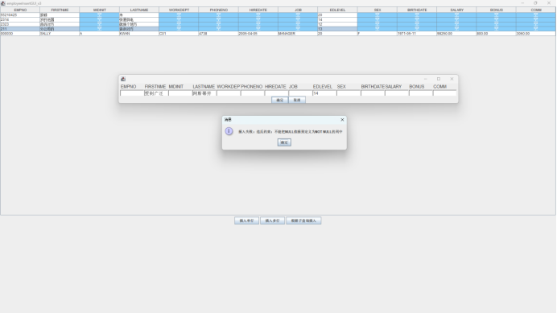
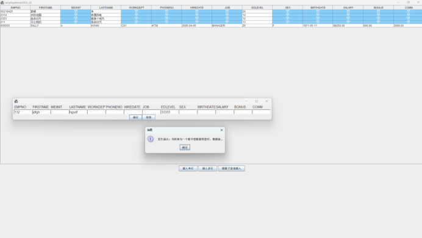
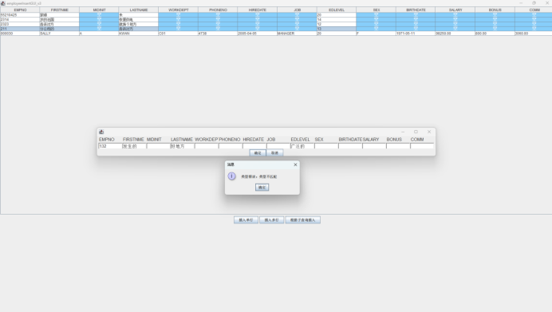

```java
import javax.swing.*;
import javax.swing.table.TableCellRenderer;
import java.awt.*;
import java.sql.*;
import java.util.ArrayList;

public class employeeInsertGUI_v3 {
    ArrayList<String> columns;
    ArrayList<String> types;
    Connection connection;
    ArrayList<ArrayList<String>> dataToInsert;
    ArrayList<ArrayList<String>> data;
    String table;
    JScrollPane scrollPane;

    public employeeInsertGUI_v3() {
        connection = connectToDB();
        scrollPane = new JScrollPane();
        table = "TEMPLEM";
        reloadData();
        showDataTable();
    }

    private void reloadData() {
        try {
            Statement statement = connection.createStatement();
            ResultSet resultSet = statement.executeQuery("SELECT * FROM " + table);
            // 获取列名
            ResultSetMetaData metaData = resultSet.getMetaData();
            int columnCount = metaData.getColumnCount();
            columns = new ArrayList<>();
            for (int i = 0; i < columnCount; i++) {
                columns.add(metaData.getColumnName(i + 1));
            }
            // 获取列类型
            types = new ArrayList<>();
            for (int i = 0; i < columnCount; i++) {
                types.add(metaData.getColumnTypeName(i + 1));
            }
            // 获取数据
            data = new ArrayList<>();
            while (resultSet.next()) {
                ArrayList<String> row = new ArrayList<>();
                for (int i = 0; i < columnCount; i++) {
                    row.add(resultSet.getString(i + 1));
                }
                data.add(row);
            }
            reloadDataTable();
        } catch (Exception e) {
            JOptionPane.showMessageDialog(null, e.getMessage());
        }
    }

    private Connection connectToDB() {
        try {
            Class.forName("com.ibm.db2.jcc.DB2Driver");
            connection = DriverManager.getConnection(
                    "jdbc:db2://192.168.80.128:50000/sample",
                    "db2admin",
                    "db2admin"
            );
        } catch (Exception e) {
            JOptionPane.showMessageDialog(null, "连接数据库失败：" + e.getMessage());
        }
        return connection;
    }

    // 插入任意条记录
    private void insertRows(String table) {
        try {
            Statement statement = connection.createStatement();
            // 批量插入
            for (ArrayList<String> row : dataToInsert) {
                StringBuilder sql = new StringBuilder("INSERT INTO " + table + " VALUES (");
                for (int i = 0; i < row.size(); i++) {
                    if (row.get(i).isEmpty()) {
                        sql.append("NULL");
                    } else {
                        sql.append("?");
                    }

                    if (i != row.size() - 1) {
                        sql.append(", ");
                    }
                }
                sql.append(")");
                PreparedStatement preparedStatement = connection.prepareStatement(sql.toString());
                int index = 1;
                for (int i = 0; i < row.size(); i++) {
                    if (row.get(i).isEmpty()) {
                        continue;
                    } else if (types.get(i).equals("VARCHAR") ||
                            types.get(i).equals("CHAR") ||
                            types.get(i).equals("DATE")) {
                        preparedStatement.setString(index, row.get(i));
                    } else if (types.get(i).equals("INTEGER")) {
                        preparedStatement.setInt(index, Integer.parseInt(row.get(i)));
                    } else if (types.get(i).equals("SMALLINT")) {
                        System.out.println(row.get(i));
                        preparedStatement.setShort(index, Short.parseShort(row.get(i)));
                    } else if (types.get(i).equals("DECIMAL")) {
                        preparedStatement.setBigDecimal(index, new java.math.BigDecimal(row.get(i)));
                    }
                    index++;
                }
                preparedStatement.executeUpdate();
            }
            JOptionPane.showMessageDialog(null, "插入成功");
            reloadData();
        } catch (SQLException e) {
            handleSQLError(e);
        } catch (NumberFormatException e) {
            String message = e.getMessage();
            if (message.contains("out of range")) {
                message = "发生溢出：当转换为一个数字型数据类型时，数据溢出";
            } else {
                message = "类型错误：类型不匹配";
            }
            JOptionPane.showMessageDialog(null, message);
        }
    }

    private void reloadDataTable() {
        Object[][] data;
        if (!this.data.isEmpty()) {
            data = new Object[this.data.size()][this.data.get(0).size()];
            for (int i = 0; i < this.data.size(); i++) {
                for (int j = 0; j < this.data.get(i).size(); j++) {
                    data[i][j] = this.data.get(i).get(j);
                }
            }
        } else {
            data = new Object[0][0];
        }
        System.out.println(data.length);

        // 将null值显示为"空"
        JTable dataTable = new JTable(data, columns.toArray()) {
            @Override
            public Component prepareRenderer(TableCellRenderer renderer, int row, int column) {
                Object value = getModel().getValueAt(row, column);
                if (value == null) {
                    JPanel component = new JPanel();
                    component.setBackground(new Color(0x87CEFA));
                    JLabel label = new JLabel("空");
                    label.setForeground(Color.WHITE);
                    label.setFont(new Font("宋体", Font.BOLD, 16));
                    label.setHorizontalAlignment(JLabel.CENTER);
                    label.setVerticalAlignment(JLabel.CENTER);
                    component.add(label);
                    component.setLayout(new GridLayout(1, 1));
                    return component;
                } else {
                    Component component = super.prepareRenderer(renderer, row, column);
                    return component;
                }
            }
        };
        scrollPane.setViewportView(dataTable);
    }

    private void showDataTable() {
        JFrame frame = new JFrame("employeeInsertGUI_v3");
        JPanel panel = new JPanel();

        scrollPane.setSize(800, 800);
        panel.add(scrollPane);

        // 插入按钮
        JButton insertButton = new JButton("插入单行");
        JButton insertMultiButton = new JButton("插入多行");
        JButton insertBySubqueryButton = new JButton("根据子查询插入");

        // 绑定事件
        insertButton.addActionListener(e -> handleInsertButton());
        insertMultiButton.addActionListener(e -> handleInsertMultiButton());
        insertBySubqueryButton.addActionListener(e -> handleInsertBySubqueryButton());

        // 将按钮添加到面板
        Panel buttonPanel = new Panel();
        buttonPanel.add(insertButton);
        buttonPanel.add(insertMultiButton);
        buttonPanel.add(insertBySubqueryButton);
        panel.add(buttonPanel);

        panel.setLayout(new BoxLayout(panel, BoxLayout.Y_AXIS));

        frame.setContentPane(panel);
        frame.setDefaultCloseOperation(JFrame.EXIT_ON_CLOSE);
        frame.pack();
        frame.setVisible(true);
    }

    private void showInsertMultiGUI(int rowCount) {
        JFrame frame = new JFrame();
        JPanel panel = new JPanel();
        JPanel labels = new JPanel();// 列名
        JPanel[] inputs = new JPanel[rowCount]; // 输入框
        for (String column : columns) {
            labels.add(new Label(column));
        }
        for (int i = 0; i < rowCount; i++) {
            inputs[i] = new JPanel();
            for (int j = 0; j < columns.size(); j++) {
                inputs[i].add(new TextField());
            }
        }
        panel.add(labels);
        for (int i = 0; i < rowCount; i++) {
            panel.add(inputs[i]);
        }

        labels.setLayout(new GridLayout(0, labels.getComponentCount()));
        for (int i = 0; i < rowCount; i++) {
            inputs[i].setLayout(new GridLayout(0, inputs[i].getComponentCount()));
        }
        panel.setLayout(new BoxLayout(panel, BoxLayout.Y_AXIS));

        // 添加确定按钮和取消按钮
        JButton confirmButton = new JButton("确定");
        JButton cancelButton = new JButton("取消");
        confirmButton.addActionListener(e -> {
            dataToInsert = new ArrayList<>();
            for (int i = 0; i < rowCount; i++) {
                ArrayList<String> row = new ArrayList<>();
                for (int j = 0; j < columns.size(); j++) {
                    row.add(((TextField) inputs[i].getComponent(j)).getText());
                }
                dataToInsert.add(row);
            }
            insertRows(table);
            frame.dispose();
        });
        cancelButton.addActionListener(e -> frame.dispose());
        JPanel buttonPanel = new JPanel();
        buttonPanel.add(confirmButton);
        buttonPanel.add(cancelButton);
        panel.add(buttonPanel);
        buttonPanel.setLayout(new BoxLayout(buttonPanel, BoxLayout.X_AXIS));

        panel.setLayout(new BoxLayout(panel, BoxLayout.Y_AXIS));
        frame.setContentPane(panel);
        frame.pack();
        frame.setVisible(true);
    }

    private void handleInsertButton() {
        showInsertMultiGUI(1);
    }

    private void handleInsertMultiButton() {
        // 获取用户输入
        String input = JOptionPane.showInputDialog("请输入要插入的行数");
        if (input == null) {
            return;
        }
        int rowCount = Integer.parseInt(input);
        showInsertMultiGUI(rowCount);
    }

    private void handleInsertBySubqueryButton() {
        String subquery = JOptionPane.showInputDialog("请输入子查询");
        if (subquery == null) {
            return;
        }
        try {
            Statement statement = connection.createStatement();
            String sql = "INSERT INTO " + table + " ";
            sql += subquery;
            statement.executeUpdate(sql);
            JOptionPane.showMessageDialog(null, "插入成功");
        } catch (SQLException e) {
            handleSQLError(e);
        }
        reloadData();
    }

    private void handleSQLError(SQLException e) {
        int errorCode = e.getErrorCode();
        System.out.println(errorCode);
        String message = "";
        if (errorCode == -407) {
            message = "违反约束：不能把NULL值插到定义为NOT NULL的列中";
        } else if (errorCode == -413||errorCode == -302) {
            message = "发生溢出：当转换为一个数字型数据类型时，数据溢出";
        } else {
            message = e.getMessage();
        }
        JOptionPane.showMessageDialog(null, "插入失败：" + message);
    }

    public static void main(String[] args) {
        new employeeInsertGUI_v3();
    }
}
```
实验结果如下：
1. 违反约束

   

2. 发生溢出

   

3. 类型错误

   

这一题没有很多需要注意的地方，算是一种之前犯过的错的总结。