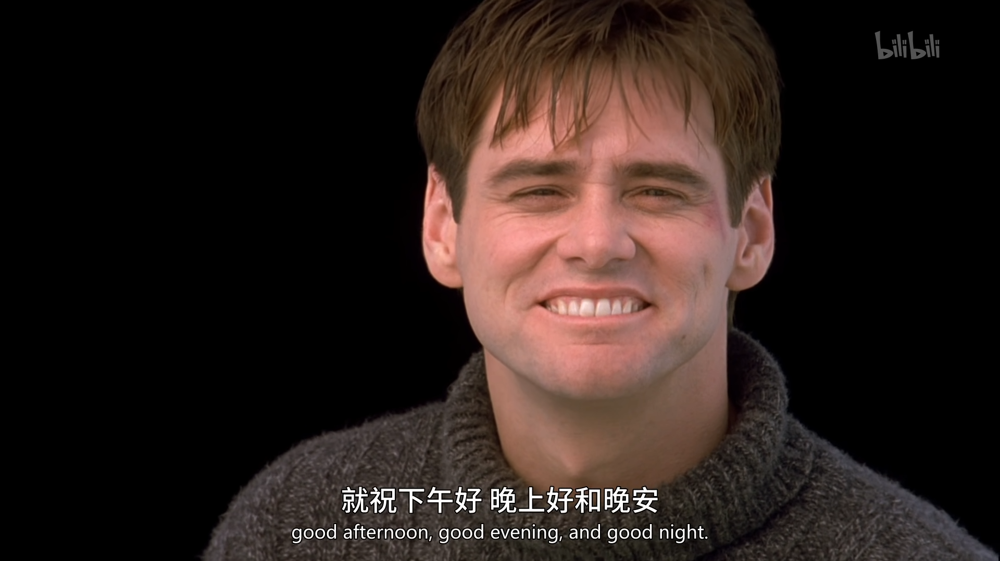

"Good morning, and in case I don't see you, good afternoon, good evening, and good night!"

这是我在还看这部电影之前，就已经听过很多遍的台词，如果再也见不到你，祝你下午好、晚上好、晚安。

这句话大体来说，应当在电影中出现了四次，第一次出现在电影的开头，楚门起床，出门，并且习惯性的跟黑人夫妇打招呼，互道早上好；第二次出现在楚门秀节目屏幕上，视角是屏幕外的观众；第三次出现在楚门意识到他所生活的世界是一场大型真人秀，他的友情亲情和一切不过是一场人为安排的情景剧；第四次就是楚门找到了秀场的出口，隔空和导演基斯督对话的结尾。这句话应当是每一个看这部电影的人最先留意到的金句。在我看来，这句话从头至尾都体现出楚门的善意，一开始是礼节，是对街坊邻里的关心和尊重，哪怕到了最后，真相大白，他也愿意对看他笑话的和安排他命运的人，道一声早安。他没有表现过很恶意的情绪，虽然可以感受到过程中他的困惑和愤懑，尤其是第三次，他对着监控道早安，当时他的言语中甚至带有一丝嘲弄，但是没有过气馁和妥协，哪怕导演安排了和父亲的重逢，希望能让他就范并把自己的思考当作多疑。

我认为这是楚门能走出这一切的内在因素，他是一个冒险家，遇见困难他不会怨天尤人，电影中他找挚友马克聊过很多次，也能感觉到楚门渐渐意识到陪伴多年的兄弟也是一个演员，但是楚门并没有因此感到不公，反而格外冷静，这里其实和肖申克的救赎很像，都悄无声息的挖了地道，实现了常人无法想象的跨逃。

电影中出现过很多外界因素也促使了楚门的觉醒，最最开始的也是最最重要的，无疑是楚门的初恋，也是唯一一个在剧场之外关心楚门过的好不好的人。当然这一段炽热的爱情也只不过是埋下伏笔，明面上的第一次出现问题，是电影开头天上掉下来的摄影灯，这算是被打造的十分完美的楚门的世界的第一道裂缝。这之后又出现了各种荒诞的场景，天上下雨，只追着楚门下；广播里直播追踪着楚门的行踪，电梯处居然是布景的地方；楚门出行时碰见的种种不可思议的问题，飞机一个月订不到票、巴士故障、开车出行则突然堵车（同一条路的另一端却空无一车）、过桥之后的大火和核电站泄露更是感觉荒诞无比，似乎实在是楚门秀的导演太过自负，自负于了解楚门胜过楚门自己，以至于不屑于一定要自然的收敛他的意图。

即使你知道自己被蒙在鼓里，你也未必有这勇气走出舒适圈。

"We accept the reality of the world with which we're presented."

这是导演的狂妄言语，我却思考我未必能证明他的自负是错误的，因为我不认为自己一定有楚门这份勇气，即使楚门的牢笼是被他人圈定的，即使我们大多数人是画地为牢。

呆在舒适圈里，他有爱他的母亲和妻子，有从七岁就开始厮混的兄弟，大家都以他为中心，即使大家并不关心他过的开不开心，但是走出舒适圈，意味着曾经鼓舞着他推动着他激励着他的人和事，都变成了阻力，大家都不希望他走出来，除了戏中生情的他的初恋Sylvia，而Sylvia在楚门的觉醒和行动过程中给不到任何帮助。是的，走出舒适圈，往往意味着放弃安稳和舒适，往往所爱的所相信的人，都会给到指责和失望，所以这需要莫大的坚定和底气。

"lf his was more than a vague ambition, if he was determined,to discover the truth, there's no way we could prevent him."

导演以极其狂妄的语气说出这番话，但是楚门做到了，以性命为赌注，他躲过了所有监控、所有人的视线、所有安排所有羁绊，他出海了，面对导演安排的狂风暴雨却没有退让的念头，自他解开拴绳扬帆的那一刻，就已经没有挽回的余地了，楚门就不再是观众们想看的楚门了，他也不可能心安理得的回去当那个他人眼中的傻子了，但是最后的机会却是导演给的，导演在楚门濒死之际结束了暴风雨，让楚门走到了出口，有了跟导演他一生的幕后之手对话的机会。

导演说他比楚门还要了解楚门，但是导演却低估了Sylvia在楚门心中的影响力，这是跨越了很多年、当时机来临却依旧滚烫的情感，可以支撑着楚门走过很远的路，做出很多本不敢做出的决定。很多人说导演不淹死楚门，是导演看着楚门从小长到大的爱，我却不这么认为，我认为这是导演对于楚门秀这部他毕其一生执导的艺术作品的近乎偏执的爱，他认为他到最后仍然可以支配着剧情走向，仍然对人性保持着十分的驾驭，可事实却证明他错了。

关门，意味着可以无忧无虑、每天不需要考虑太多事情，可以按部就班的过完一生，在街坊邻里都有一个好名声，因为大家彼此都是同类人。开门，意味着脱离生活了三十多年的世界，像个土著人跑到了现代人的地盘，充满了未知和危险，也可能让自己大失所望，甚至可能比他所生活的虚假的世界还要虚假，生活不再充满善意，困难的结尾也不是终被克服，他也真正成为了芸芸众生中的一员，这，本都是可以让他关门的理由，但是只需要一个理由，就可以让他在门前不在踌躇而是向前走去，那就是Sylvia。

即使前方茫茫无期，但是起码可以与你真实的相拥，足矣。

于是他开门，向新世界走去，孤独的踏上检视真实的道路。

