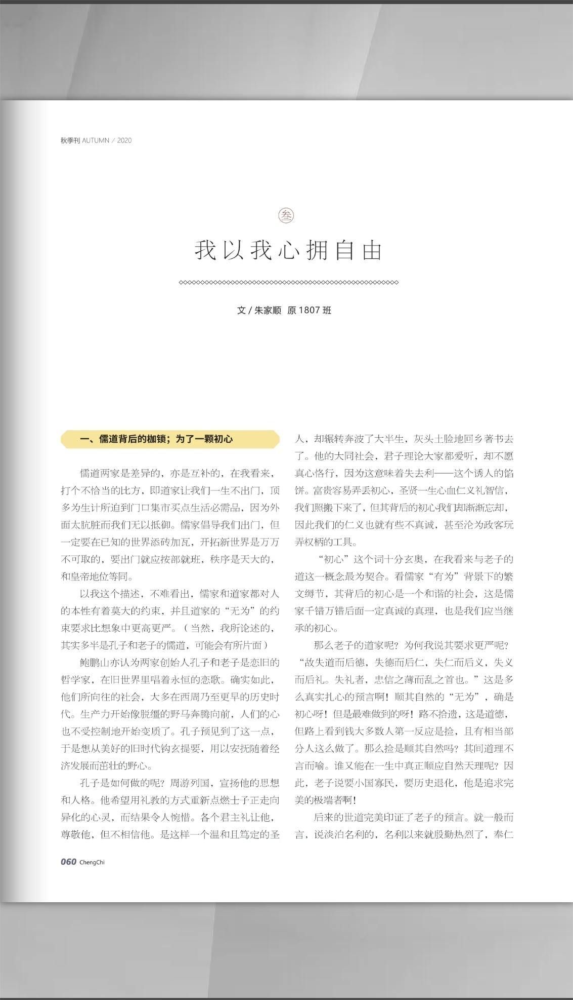

## 一、儒道背后的枷锁：为了一颗初心

儒道两家是差异的，亦是互补的，在我看来，打个不恰当的比方，即道家让我们一生不出门，顶多为生计所迫到门口集市买点生活必需品，因为外面太肮脏而我们无以抵御。儒家倡导我们出门，但一定要在已知的世界添砖加瓦，开拓新世界是万万不可取的，要出门就应按部就班，秩序是天大的：和皇帝地位等同。

以我这个描述，不难看出，儒家和道家都对人的本性有着莫大的约束，并且道家的“无为”的约束要求比想象中更高更严。（当然，我所论述的：其实多半是孔子和老子的儒道，可能会有所片面)

鲍鹏山亦认为两家创始人孔子和老子是恋旧的哲学家，在旧世界里唱着永恒的恋歌。确实如此，他们所向往的社会，大多在西周乃至更早的历史时代。生产力开始像脱缰的野马奔腾向前，人们的心也不受控制地开始变质了。孔子预见到了这一点，于是想从美好的旧时代钩玄提要，用以安抚随着经济发展而茁壮的野心。

孔子是如何做的呢？周游列国，宣扬他的思想和人格。他希望用礼教的方式重新点燃士子正走向异化的心灵，而结果令人惋惜。各个君主礼让他，尊敬他，但不相信他。是这样一个温和且笃定的圣人，却辗转奔波了大半生，灰头土脸地回乡著书去了。他的大同社会，君子理论大家都爱听，却不愿真心恪行，因为这意味着失去利————这个诱人的馅饼。富贵容易弄丢初心，圣贤一生心血仁义礼智信，我们照搬下来了，但其背后的初心我们因渐渐忘却，因此我们的仁义也就有些不真诚，甚至沦为政客玩弄权柄的工具。

“初心”这个词十分玄奥，在我看来与老子的道这一概念最为契合。看儒家“有为”背景下的繁文缛节，其背后的初心是一个和谐的社会，这是儒家千错万错后面一定真诚的真理，也是我们应当继承的初心。

那么老子的道家呢？为何我说其要求更严呢？“故失道而后德，失德而后仁，失仁而后义，失义而后礼。失礼者，忠信之薄而乱之首也。”这是多么真实扎心的预言啊！顺其自然的“无为”，确是初心呀！但是最难做到的呀！路不拾遗，这是道德，但路上看到钱大多数人第一反应是捡，且有相当部分人这么做了。那么捡是顺其自然吗？其间道理不言而喻。谁又能在一生中真正顺应自然天理呢？因此，老子说要小国寡民，要历史退化，他是追求完美的极端者啊！

后来的世道完美印证了老子的预言。就一般而言，说淡泊名利的，名利一来就殷勤热烈了，奉仁义之说的，利益出现就只会巧舌如簧了。高尚是高尚者的墓志铭，卑部是卑鄙者的通行证。有些东西就是这样，一个现象的出现就一发不可收拾，于是无价的东西就真的失去了价值。当我们需要用枷锁来定义高尚时，说明世道已十足卑鄙了。

当我们与先贤相去甚远时我们就应当开始反思了：当老子出走的时就应当开始了；当一个绝顶智者都不屑于为我们发光发热时，就应当开始了。时至今日，哪怕儒道之中有太多槽糠要被摒弃，我们仍需思索其中的价值————甚至有人需要从其间形而下的制度中寻找药方，我们就更应思考这个问题了。

## 二、儒道以后的自由：不忘那一颗初心

过去盛行的是儒道理论，当今流行讲自由，但我认为要真正体悟这些文化，共通且本质的一点是初心。两者差异的在于，自由少了枷锁，没有道德的约束。

我们应寻找到自己心之所向的东西，并为之守望。不论是心系天下为天下立命，还是钟情山水如琢如磨，或是自由随风任意而东，都需这样近乎“道"式的初心，才不至于矫揉造作，南辕北辙。不论是意气用事还是意利用事，都把初心放在了一边，我们的守望应当是郑重而坚定的。不信你看，雅典的自由处死了苏格拉底，东汉的仁义逼死了李固，以上算是自由吗？顺应自然吗？是否真的契合那颗清澈的初心呢？

我们应当从儒道文化中意识到这一点，才不枉圣贤们含泪的一生。各人的初心具体不一，但不谋而合的是，他们都有着热爱梦想，不为名利所顾忌的正义的愿景阿！那颗正能量的心是生活的底线，没有底线，就没有儒道，没有自由。一颗不能殉道，委屈求全的心，岂能被称之为初心？

说到底，不过是一颗向往美好，执着于美好的心罢了。“若君肯惜顾，落泥也胜妆”，不过如此。有心如斯，心系天下是君子，心在江湖是圣人，向住自由是英雄，任儒任道也殊途同归了。

被儒道统治的时代已彻底逝去，我们向往出门，并且必须出门，但临行前一定要看一看这个家，牢记先贤的叮嘱，出门便是一场远征。

“偶尔走失，从未离开。没有比生活更古老的过去，也没有比生活更高远的未来。无论经历多少波折，困苦与残酷，人们对美好生活的追寻，亘古如新。”

以生活的名义，我以我心拥自由，愿称之为我的儒道。

