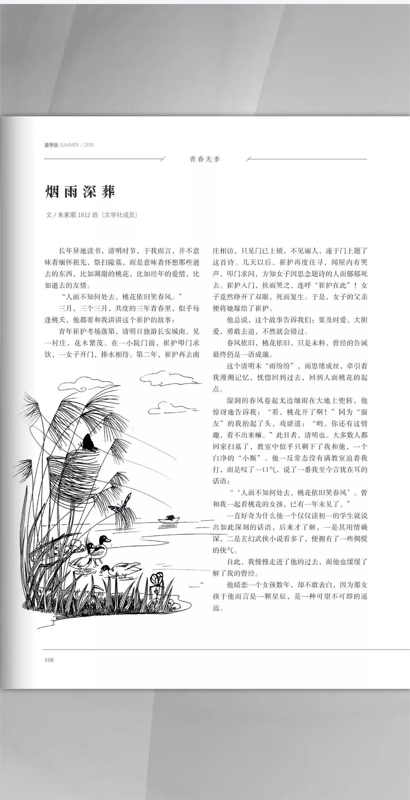
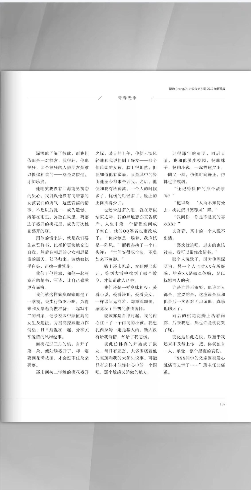
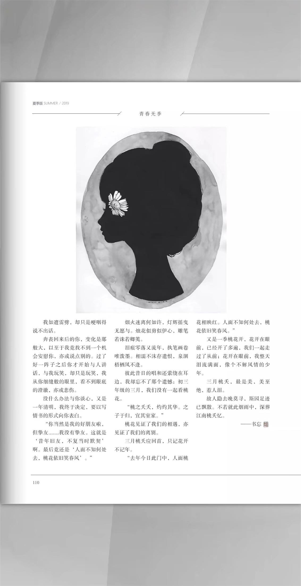

长年异地读书，清明时节，于我而言，并不意味着缅怀祖先，祭扫陵墓，而是意味着怀想那些逝去的东西，比如调谢的桃花，比如经年的爱情，比如逝去的友情。

“人面不知何处去，桃花依旧笑春风。”

三月，三个三月，共度的三年青春里，似平每逢桃天，他都要和我讲讲这个崔护的故事：

青年崔护考场落第，清明日独游长安城南，见一村庄，花木繁茂。在一小院门前，崔护叩门求饮，一女子开门，捧水相待。第二年，崔护再去南庄相访，只见门已上锁，不见丽人，遂于门上题了这首诗。几天以后，崔护再度往寻，闻屋内有哭声，即门求问，方知女子因思念题诗的人而郁郁死去。崔护入门，扶而哭之，连呼“崔护在此”！女子竞然睁开了双眼，死而复生。于是，女子的父亲便将她嫁给了崔护。

他总说，这个故事告诉我们：要及时爱，大胆爱，勇敢去追，不然就会错过。

春风依旧，桃花依旧，只是未料，曾经的告诚最终仍是一语成谶。

这个清明未“雨纷纷”，而思绪成丝，牵引着我漫潮记忆，恍惚回到过去，回到人面桃花的起点。

湿润的春风卷起无边细雨在大地上兜转，他惊讶地告诉我：“看，桃花开了啊！”同为“窗友”的我拾起了头，戏谑道：“哟，你还有这情趣，看不出来嘛。”此日者，清明也。大多数人都回家扫墓了，教室中似平只剩下了我和他，一个白净的“小厮”。他一反常态没有满教室追着我打，而是叹了一口气，说了一番我至今言犹在耳的话语：

“‘人面不知何处去，桃花依旧笑春风’。曾和我一起看桃花的女孩，已有一年未见了。”一直好奇为什么他一个仅仅读初一的学生就说出如此深刻的话语，后来才了解，一是其用情确深，二是玄幻武侠小说看多了，便拥有了一些倜傥的侠气。自此，我慢慢走进了他的过去，而他也缓缓了解了我的曾经。

他暗恋一个女孩数年，却不敢表白，因为那孩于他而言是一颗星辰，是一种可望不可即的遥远。

深深地了解了彼此，而我们依旧是一对损友，我很狂，他也很狂，两个很狂的人做朋友是难以惺惺相惜的一总是要错过，才知珍贵。

他嘲笑我没有回海南见初恋的决心，我讥讽他没有向暗恋的女孩表白的勇气，这些青涩的情事，不想以后竟一一成为遗憾，溶解在雨里，弥散在风里，凋落进了盛开的桃花里，成为每次桃花盛开的殇。

用他的话来讲，就是我们要先遍览群书，比崔护更快地充实自我，然后在相思的少女相思最重的那天，驾马归来，请姑娘执手白头，还她一世繁花。

我信了他的邪，和他一起写意淫的情书，写诗，让自己感觉更有逼格。

我们就这样疯疯癫癫地过了一学期，去步行街吃小吃，为将来和女票逛街做准备；一起写中二的档案，记录校园中颜值高的女生及追法，为提高撩妹能力作铺垫；日日厮混在一起，分享关乎爱情的风雅趣事。

而桃花那三月的桃，自开了第一朵，便陆续盛开了，却一定要到花满枝桠，才会忍不住朵朵凋落。

还未到初二年级的桃花盛开之际，某日的上午，他便云淡风轻地和我说他删了好友一那个他暗恋的女孩。脸上很坦然，但我知道他有多痛，只是其中的缘由他至今都未告诉我。之后，他便和我有所疏离，一个人的时候多了，忧伤的时候多了，脸上的肥肉抖得少了。

也还未过多久吧，就在寒假结束之际，我的异地恋亦宣告破产，人生中第一个情侣空间成了空白。他的QQ签名也更改成了：“你应该是一场梦，我应该是一阵风。”而我亦换了一个口头禅：“世间安得双全法，不负如来不负卿。”

骑士还未凯旋，女孩便已离开，等到大雪中找到了那个故乡，才知道故人已去。

我们还是一样臭味相投：爱看小说，爱看漫画，爱看美女。一样课间鬼混着，却浑浑噩噩感觉没了当初的豪情满怀。

应该亦是自那时起，我的内心住下了一个内向的小孩。我想扎西拉姆一定是骗人的，斯人没有给我诗情，却给了我悲伤。

彼此仿佛真的开始成了损友，每日有互怼，大多围绕着他的雀斑和我的大额头说事。可能只有这样才能弥补心中的一个洞吧，那个敏感又骄做的地方。

记得那年的清明，雨后天晴，我和他漫步校园，畅聊妹子，畅聊小说，一起描述夕阳，一圈又一圈，仿佛时间静止，仿佛过往成烟。

“还记得崔护的那个故事吗？”

“记得啊，‘人面不知何处去，桃花依旧笑春风’嘛。”

“我问你，你是不是真的喜欢XX?”

支吾着，其中的一个人说不出话。

“喜欢就追吧，过去的也该过去，我可以帮你改情书。”

那个人沉默了，因为他深深明白，另一个人也对XX有所好感，毕竟XX是那么体贴，足以抚慰两人的殇。

谁是谁并不重要，也许两人都是。重要的是，这应该是我和他最后一次面对面坦诚地，真挚地聊天了。

雨后的桃花花瓣上沾着雨露，后来我想，那也许是桃花哭了呢。

变化是如此之快，以至于我还来不及帮上你一把，你就独自一人，承受一整个黑夜的哀伤。

“XXX同学的父亲因突发心脏病而去世了…”班主任悲痛道。

我如遭雷劈，却只是哽咽得说不出话。

奔丧回来后的你，变化是那般大，以至于我竞找不到一个机会安慰你，亦或说点别的。过了好一阵子之后你才开始与人讲话，与我玩笑，却只是玩笑，我从你细缝般的眼里，看不到眼底的澄澈，亦或悲伤。

没什么办法与你谈心，又是一年清明，我终于决定，要以写情书的形式向你表白。

“你当然是我的好朋友啦.但挚友我没有挚友。这就是·昔年旧友，不复当时默契”啊。最后竞还是·人面不知何处去，桃花依旧笑春风’。”

烟火迷离何如许，灯辉摇曳无愿与。烛花似剪似伊心，雕笔若诛若卿荑。

泪痕零落又流年，执笔画卷唯泼墨。相清不沫存遗恨，泉调梧栖风不逢。

彼此昔日的唱和还素绕在耳边，我却忘不了那个遗悠：初三年级的三月，我们没有一起看桃花。

“桃之天天，灼灼其华。之子于归，宜其室家。”

桃花见证了我们的相遇，亦见证了我们的离别三月桃天应回首，只记花开不记年。“去年今日此门中，人面桃花相映红。人面不知何处去，桃花依旧笑春风。”

又是一季桃花开，花开在眼前，已经开了多遍，我们一起走过了从前：花开在眼前，我整天泪流满面，像个不解风情的少年。

三月桃夭，最是美，美至绝，惹人泪。

故人隐去晚莫寻，斯园足迹已飘散。不若就此烟雨中，深弊江南桃夭忆。
<!-- 

 -->

