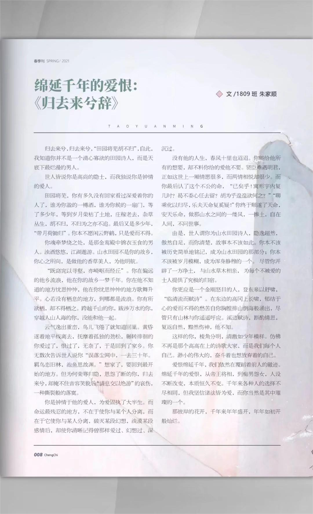

归去来兮，归去来兮，“田园将芜胡不归”，自此，我知道你并不是一个清心寡欲的田园诗人，而是天底下最烂漫的男人。

世人皆说你是高尚的隐土，而我独说你是钟情的爱人。

田园将芜，你有多久没有回家看过深爱着你的人了，谁为你盈的一樽酒，谁为你候的一扇门，等了多少年，等到岁月荣枯了土地，庄稼老去，杂草丛生，胡不归，不归为之亦不追。最后又是多少年，“带月荷锄归”。你本不愿闲云野鹤，只是爱而不得。

你魂牵梦绕之处，是那金鸾殿中锦衣玉食的男人。浊酒悠悠，江湖遨游。山水田园不是你的故乡，你心之所向，是做他的香草美人，为他明航。

“既窈窕以寻壑，亦崎岖而经丘”。你在偏远的他乡流浪，他在你的故乡一梦千年。你在他不知道的地方忧思仲仲，他在你忧思忡忡的地方歌舞升平。心若没有栖息的地方，到哪都是流浪。你有所欲栖，却不得栖之。跨越千山的你，跋涉万水的你，穿越人山人海的你，没能和他一起。

云气逸出重峦，鸟儿飞倦了就知道回巢。黄昏逐着地平线离去，抚摩着孤独的劲松，辗转徘徊的你爱过了，恨过了，无奈了，于是回到了家乡。你无数次告诉世人说你“误落尘网中，一去三十年。羁鸟恋旧林，池鱼思故渊。”想家了，要回到最开始的地方。但为何荣辱归隐，恩怨了断的你，归去来兮，却掩不住音容笑貌后“请息交以绝游”的哀伤，一种撕裂般的落寞。

你是钟情于他的爱人，为爱固执了大半生。而命运最残忍的地方，不在于使你与某个人分离，而在于它使你与某人分离，破灭某段幻想，淡漠某段感情后，却使你清晰记得曾那样爱过、幻想过、深沉过。

没有他的人生，春风十里也迢迢。你能给他所有的想要，却不料你给的爱他不要。贤臣难遇明君，正如这世上一厢情愿很多，而两情相悦却很少。而你最后认了这个不公的命，“已矣乎！寓形宇内复几时？曷不委心任去留？胡为乎遑遑欲何之？”“聊乘化以归尽，乐夫天命复奚疑！”你终于顺遂了天命，安天乐命，做那山水之间的一楼风，一捧土，自在人间，不问世事。

由是，世人谓你为山水田园诗人，隐逸超然，傲然自足，而你清楚，故事木不该如此。你本不该被历史简单地铭记，成为山水田园的那部分；你本不该被岁月模糊，成为浑身静穆的一个。尽管你开辟了一方净土，与山水草木相亲，为每个不被爱的士人提供了究极的归宿。

你更应是一个金刚怒目的人，登东皋以舒啸，“临清流而赋诗”。在东边的高冈上长啸，郁结于心的爱而不得的愁苦自你胸膛排山倒海般涌出，尽管只有山林与你遥遥呼应。溪边赋诗，斟酌情思，复返自然，黯然伤神，他不知。

这样的你，棱角分明，清澈如少年模样。仿佛不再是那个高高在上的诗歌大家，而是我们每个人自己。渺小的伟大的，奋斗着也想放弃着的自己。

爱恨绵延千年，我们依然在覆蹈着前人的辙迹。绵延千年的爱恨，从帝王将相，到痴男怨女，人设不断改变，本质恒久不变。千年来各种人的选择不尽相同，但我坚信诸法皆为爱，而你当然是其中璀璨的一个。

那彼岸的花开，千年来年年盛开，年年如初开般灿烂。

 

