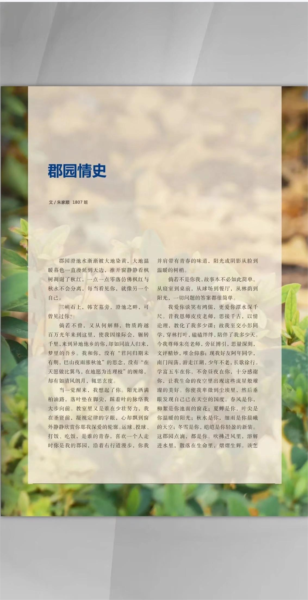
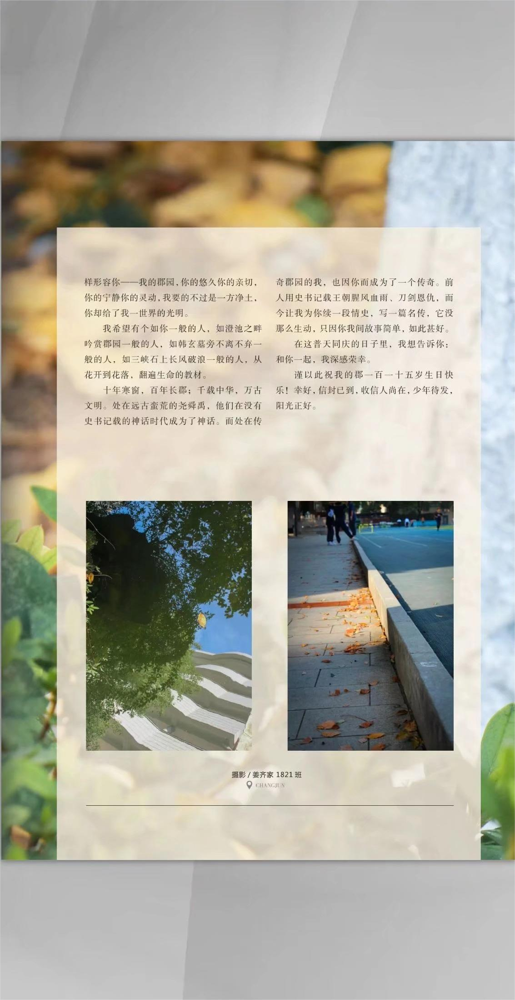

郡园澄池水渐渐被大地染黄，大地温暖暮色一直漫延到天边，推开窗静静看枫树调谢了秋红，一点一点零落仿佛枫红与秋永不会分离，每当看见你，就像另一个自己。

三峡石上，韩玄墓旁，澄池之畔，可曾见过你？

倘若不曾，又从何解释，物质跨越百万光年来到这里，使我因缘际会，辗转千里，来到异地他乡的你，却如同故人归来，梦里的吾乡。我和你，没有“君问归期未有期，巴山夜雨涨秋池”的思念，没有“在天愿做比翼鸟，在地愿为连理枝”的缠绵，却有如清风朗月，辄思玄度。

当一觉醒来，我想起了你。阳光洒满柏油路，落叶垫在脚尖，踩着叶的脉络我大步向前。教室里又是谁在少壮努力，我在圣贤前，凝视定律的字眼，心却飘到窗外静静欣赏你那我深爱的轮廓。运球、投球、打饭、吃饭，是谁的青春，喜欢一个人走时你是我的郡园，沿着右行道漫步，你我并肩带有青春的味道，阳光或阴影从脸到温暖的树梢。

倘若不是你我，故事本不必如此简单。从寝室到桌前，从球场到餐厅，从林荫到阳光，一切问题的答案都很简单。

我爱你谈笑有鸿儒，更爱你潭水深千尺。昔我恩师皮皮老师，思接千古，以情论理，教化了我多少课：故我至交小彭同学，穿林打叶，磕磕绊绊，陪伴了我多少天。今我尊师朱亮老师，旁征博引，思量深刻，文评精妙，唯余仰慕：现我好友阿年同学南门闯荡，游走江湖，少年不老，长歌徐行。学富五车在你，不舍昼夜在你，十分感谢你，让我生命的夜空里出现这些流星般璀璨的美好。你使我卑微到尘埃里，然后垂眼发现自己已在天空的国度。春风是你，柳絮是你池面的窗花；夏蝉是你，叶尖是你温暖的阳光：秋水是你，细雨是你晨曦的天空：冬雪是你，皑皑是你轻盈的新装。这郡园点滴，都是你。吹拂进风里，溶解进水里，散落在生命里，熠熠生辉。该怎样形容你一一我的郡园，你的悠久你的亲切，你的宁静你的灵动，我要的不过是一方净土，你却给了我一世界的光明。

我希望有个如你一般的人，如澄池之畔吟赏郡园一般的人，如韩玄墓旁不离不弃一般的人，如三峡石上长风破浪一般的人，从花开到花落，翻遍生命的教材。

十年寒窗，百年长郡：千载中华，万古文明。处在远古蛮荒的尧舜禹，他们在没有史书记载的神话时代成为了神话。而处在传奇郡园的我，也因你而成为了一个传奇。前人用史书记载王朝腥风血雨、刀剑恩仇，而今让我为你续一段情史，写一篇名传，它没那么生动，只因你我间故事简单，如此甚好。

在这普天同庆的日子里，我想告诉你：和你一起，我深感荣幸。

谨以此祝我的郡一百一十五岁生日快乐！幸好，信封已到，收信人尚在，少年待发，阳光正好。

